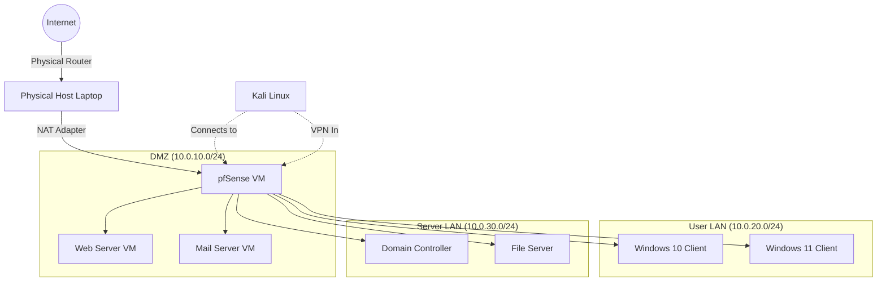

# Virtual Lab Architecture: Designing Enterprise-Grade Environments

---
title: "Virtual Lab Architecture"
parent: "[[01_Foundations]]"
tags:
  - foundations
  - lab
  - virtualization
  - network-design
  - infrastructure
created: 2026-01-23
updated: 2026-01-23
---

> **Executive Summary**: A penetration tester is only as good as their practice environment. You cannot learn to exploit an Active Directory forest, pivot through subnets, or evade EDR solutions by reading about them. You must build them. This chapter is the definitive engineering guide to designing, building, and maintaining a scalable, safe, and complex virtual hacking lab that simulates real-world corporate networks.

---

## Table of Contents
1. [Learning Objectives](#1-learning-objectives)
2. [Hardware Requirements & Optimization](#2-hardware-requirements--optimization)
3. [Hypervisor Selection & Architecture](#3-hypervisor-selection--architecture)
4. [Network Topologies & Isolation](#4-network-topologies--isolation)
5. [The Core Components: The "Standard Build"](#5-the-core-components-the-standard-build)
6. [Advanced Networking: The pfSense Router](#6-advanced-networking-the-pfsense-router)
7. [Active Directory Forest Design](#7-active-directory-forest-design)
8. [The "Purple Team" Stack: Logging & Monitoring](#8-the-purple-team-stack-logging--monitoring)
9. [Infrastructure as Code (IaC)](#9-infrastructure-as-code-iac)
10. [Critical Analysis & Checkpoints](#10-critical-analysis--checkpoints)

---

## 1. Learning Objectives

By the end of this chapter, you will be able to:

- **Architect Complex Networks**: Design multi-subnet environments with DMZs, LANs, and restricted zones.
- **Optimize Virtualization**: Tune hypervisor settings (vCPUs, RAM, Nested Virtualization) for maximum performance.
- **Implement Segmentation**: Securely isolate vulnerable machines from your physical network and the internet.
- **Simulate Enterprise Features**: Deploy Domain Controllers, Mail Servers, and Web Servers in a realistic topology.
- **Automate Deployment**: Understand the basics of Vagrant and Terraform for rapid lab destruction and recreation.
- **Monitor Attacks**: Set up a centralized logging server (ELK/Splunk) to view your attacks from the defender's perspective.

---

## 2. Hardware Requirements & Optimization

Building a lab is resource-intensive. While you can start small, advanced simulations (like AD Forest trusts) require significant power.

### 2.1 The "Trifecta" of Resources

#### 1. RAM (Memory) - The Critical Bottleneck
RAM is usually the first limit you hit.
- **Minimum**: 16 GB. (Runs 1 Kali + 2 Windows VMs).
- **Recommended**: 32 GB. (Runs 1 Kali + 1 DC + 2 Clients + 1 Server).
- **Ideal**: 64 GB+. (Runs multi-forest AD, Exchange, Splunk, C2 Redirectors).
- **Strategy**: Use "Memory Ballooning" or "RAM Overcommitment" carefully. Linux VMs can run headless (no GUI) on 512MB RAM. Windows Server Core needs far less RAM than Desktop Experience.

#### 2. Storage (Disk) - The Performance Bottleneck
Running 5 VMs on a mechanical Hard Drive (HDD) will result in unusable lag due to IOPS (Input/Output Operations Per Second) saturation.
- **Requirement**: NVMe SSD.
- **Capacity**:
    - Windows VM: ~40GB each (linked clones reduce this).
    - Kali: ~80GB.
    - Logs (Splunk): Massive growth over time.
- **Recommendation**: Dedicate a 1TB NVMe drive solely for VMs.

#### 3. CPU (Compute) - The Scheduler Bottleneck
Modern hypervisors are good at time-slicing CPUs.
- **Cores vs Threads**: You can assign more vCPUs than physical cores (Overprovisioning), assuming not all VMs are at 100% load simultaneously.
- **Requirement**: Modern i7/i9 or Ryzen 7/9 (8 cores / 16 threads minimum).
- **Virtualization Support**: You MUST enable **VT-x / AMD-V** in your BIOS/UEFI.

### 2.2 Laptop vs. Desktop vs. Server

| Form Factor | Pros | Cons | Verdict |
|:---|:---|:---|:---|
| **Laptop** | Portable. Hack from anywhere. | Thermal throttling. Limited RAM slots. Expensive. | Good for exams/travel. |
| **Desktop** | Cheap RAM/Storage. High performance. Silent. | Not portable. | **Best Balance.** |
| **Home Server** (R720/R730) | Massive RAM (128GB+). Enterprise features (iDRAC). | Loud. Hot. Power hungry. | For serious enthusiasts. |

---

## 3. Hypervisor Selection & Architecture

### 3.1 Type 1 vs. Type 2 Hypervisors

**Type 1 (Bare Metal)**:
- The OS *is* the hypervisor.
- **Examples**: VMware ESXi, Proxmox VE, Xen, Microsoft Hyper-V Server.
- **Pros**: Direct hardware access, near-native performance, stability.
- **Cons**: Requires dedicated hardware. You can't browse the web on the host.

**Type 2 (Hosted)**:
- Runs as an application on your OS (Windows/macOS/Linux).
- **Examples**: VMware Workstation Pro/Player, Oracle VirtualBox, Parallels.
- **Pros**: Convenience. Copy-paste between host and VM. Drag-and-drop files.
- **Cons**: Overhead from the host OS.

### 3.2 VMware Workstation Pro (The Gold Standard)
For 90% of students and professionals, this is the correct choice.
- **Features**:
    - **Snapshots**: Essential tree-based snapshots.
    - **Virtual Network Editor**: Powerful GUI for creating custom subnets (VMnet0-VMnet19).
    - **Unity Mode**: Run VM apps on host desktop.
    - **Compatibility**: Most vendor appliances (FireEye, Fortinet) distribute `.ova` files optimized for VMware.
- **Cost**: Free for personal use (Broadcom acquisition change).

### 3.3 Oracle VirtualBox (The FOSS Alternative)
- **Features**: Free, Open Source.
- **Drawbacks**:
    - Networking stack is less robust (promiscuous mode issues).
    - Performance is generally lower than VMware.
    - "Guest Additions" can be buggy on Linux kernels.
- **Verdict**: Excellent backup, but second choice for professional labs.

### 3.4 Hyper-V (The Windows Native)
- **Pros**: Fast (Type 1 hybrid). Great if your host is Windows.
- **Cons**:
    - No USB passthrough (difficult for Zigbee/WiFi dongles).
    - "Enhanced Session" mode can leak credentials.
    - Networking setup (vSwitches) is clunky compared to VMware's editor.

---

## 4. Network Topologies & Isolation

Designing the network is more important than configuring the OS.

### 4.1 Networking Modes Explained

**1. NAT (Network Address Translation)**
- **How it works**: VM sits behind the Host. Host acts as a router.
- **Access**: VM -> Internet (Yes). Internet -> VM (No). Host -> VM (Yes).
- **IP Range**: Usually `192.168.x.x` assigned by VMware DHCP.
- **Use Case**: Downloading tools, updates, browsing.

**2. Bridged**
- **How it works**: VM connects directly to your physical router (LAN).
- **Access**: VM is a peer on your home network.
- **Risk**: **HIGH**. If this VM is compromised or infected with a worm, it can attack your TV, Phone, and Family PC.
- **Use Case**: Wireless attacks, MITM on physical network. **Avoid for vulnerable labs.**

**3. Host-Only**
- **How it works**: A private switch connected only to the Host and other VMs on the same switch.
- **Access**: Internet -> VM (No). VM -> Internet (No). VM <-> VM (Yes).
- **Risk**: Low.
- **Use Case**: Malware analysis, isolated AD labs.

**4. LAN Segments (VMware Exclusive)**
- **How it works**: A private switch *disconnected* from the Host.
- **Access**: VM <-> VM (Yes). Host -> VM (No).
- **Use Case**: Deep internal networks, simulating "Air Gapped" systems.

### 4.2 Recommended Topology: The "Gateway" Model

Do not put every VM on NAT. This is lazy and insecure.
Use a **Router VM** (pfSense/VyOS) to manage traffic.



---

## 5. The Core Components: The "Standard Build"

To follow this vault effectively, build these 4 core machines.

### 5.1 The Attack Platform: Kali Linux
- **Download**: Get the official *VMware Image* (not the ISO installer). It comes pre-installed with tools and `open-vm-tools`.
- **Specs**: 4GB RAM, 2 vCPU, 80GB Disk.
- **Post-Install**:
    - `sudo apt update && sudo apt full-upgrade -y`
    - Change default password (`kali:kali`).
    - Take snapshot: "Fresh Install".

### 5.2 The Domain Controller: Windows Server 2022
- **Download**: Evaluation ISO (180 days free).
- **Specs**: 4GB RAM, 2 vCPU, 60GB Disk.
- **Setup**:
    - Install "Active Directory Domain Services" role.
    - Promote to Domain Controller (New Forest: `corp.local`).
    - DNS Server (Integrated).
- **Post-Install**:
    - Create a "Domain Admin" user (never use `Administrator` for daily tasks).
    - Take snapshot: "DC Configured".

### 5.3 The Victim Client: Windows 10/11 Enterprise
- **Download**: Evaluation ISO.
- **Specs**: 4GB RAM, 2 vCPU, 60GB Disk.
- **Setup**:
    - Join `corp.local` domain.
    - Install Chrome, Firefox, Office (or LibreOffice).
    - Disable Windows Defender (Real-time protection) via Group Policy **IF** you want to test easy exploits. Keep it ON if you want to test evasion.
- **Post-Install**:
    - Take snapshot: "Domain Joined".

### 5.4 The Vulnerable Server: Metasploitable 2/3 or Ubuntu
- **Metasploitable 2**:
    - Broken by design. Good for practicing Nmap and basic Metasploit.
    - **WARNING**: extremely vulnerable. Host-Only network ONLY.
- **Ubuntu Server (Docker Host)**:
    - Install Docker.
    - Run vulnerable containers (DVWA, Juice Shop).
    - **Specs**: 2GB RAM, 1 vCPU.

---

## 6. Advanced Networking: The pfSense Router

To simulate a real corporate environment, we need a firewall.

### 6.1 Installation
1.  **Download**: pfSense CE (Community Edition) ISO.
2.  **VM Config**:
    - **NIC 1**: Bridged or NAT (This is the WAN).
    - **NIC 2**: Host-Only/LAN Segment (This is the LAN).
3.  **Setup**:
    - Boot ISO. Install to disk.
    - Assign Interfaces:
        - WAN -> `em0` (NIC 1)
        - LAN -> `em1` (NIC 2)
    - Set LAN IP: `10.0.0.1/24`.

### 6.2 Configuration
Access the Web Interface from a VM on the LAN (e.g., your Kali box if put on the LAN, or a Windows Client).
URL: `https://10.0.0.1` (Default creds: `admin:pfsense`).

**Key Tasks**:
1.  **DHCP Server**: Enable on LAN interface. Range `10.0.0.100 - 10.0.0.200`.
2.  **DNS Resolver**: Enable Unbound DNS.
3.  **Firewall Rules**:
    - Default is "Allow LAN to any".
    - Create a rule to BLOCK `LAN -> WAN` to simulate an isolated network.
    - Create Port Forwards (NAT) to expose a web server on the LAN to the WAN side.

---

## 7. Active Directory Forest Design

A single domain is boring. Real enterprises have messy trust relationships.

### 7.1 Single Forest, Multiple Domains
- **Root Domain**: `corp.local`
- **Child Domain**: `dev.corp.local`
- **Relationship**: Automatic Two-Way Transitive Trust.
- **Attack Path**: Compromise Child -> Elevate to Parent (SID History / Golden Ticket).

### 7.2 Forest Trusts
- **Forest A**: `corp.local` (Main Company).
- **Forest B**: `acquired-bank.local` (Recently acquired company).
- **Trust**: One-way trust. `corp` trusts `bank`.
- **Attack Path**: Does a user in `bank` have access to resources in `corp`?

### 7.3 Lab Automation (PowerShell)
Don't click manually. Use scripts to populate your AD.
- **Tool**: `BadBlood` or `Invoke-ADLabDeployer`.
- **Function**: Creates thousands of users, groups, OUs, and misconfigurations (ACLs) automatically.
- **Benefit**: Creates a "lived-in" feeling with noise, which is essential for learning enumeration.

---

## 8. The "Purple Team" Stack: Logging & Monitoring

If you only attack, you are learning 50% of the job. You must see what your attacks look like.

### 8.1 Splunk Free / ELK Stack
**Splunk**:
- Free license allows 500MB logs/day (plenty for a lab).
- **Install**: Ubuntu VM + Splunk `.deb` file.
- **Universal Forwarder**: Install this agent on your Windows DC and Clients.
- **Config**: Configure `inputs.conf` on Windows to monitor:
    - Security Event Log.
    - System Event Log.
    - PowerShell Script Block Logs (Event ID 4104).
    - Sysmon Events.

### 8.2 Sysmon (System Monitor)
Windows Event Logs are boring. Sysmon is granular.
- **Install**: Sysinternals Sysmon.
- **Config**: Use SwiftOnSecurity's config file (standard in industry).
- **Capability**: Detects process creation, network connections, file creation, registry modification.

### 8.3 The Feedback Loop
1.  **Attack**: Run `mimikatz` on the Windows Client.
2.  **Observe**: Go to Splunk. Search `index=main mimikatz`.
3.  **Result**: Do you see it?
    - **Yes**: What Event ID? What process spawned it?
    - **No**: Why? Did you not log process access?
4.  **Refine**: Tune Sysmon config to catch it.

---

## 9. Infrastructure as Code (IaC)

Manually clicking "New VM" is slow. Professionals script their labs.

### 9.1 Vagrant
Wrapper for VirtualBox/VMware.
- **Vagrantfile**: A text file defining the VMs.
```ruby
Vagrant.configure("2") do |config|
  config.vm.box = "kalilinux/rolling"
  config.vm.network "private_network", ip: "192.168.56.10"
end
```
- **Command**: `vagrant up` (Builds the lab). `vagrant destroy` (Deletes it).

### 9.2 Terraform + Proxmox
If you use Proxmox, Terraform is the standard.
- Define resources (VMs, Bridges, Firewalls) in `.tf` files.
- Apply state to build the entire corporate network in minutes.

---

## 10. Critical Analysis & Checkpoints

### 10.1 Common Pitfalls
1.  **IP Conflicts**: Manually assigning IPs that overlap with DHCP ranges. Always keep static IPs outside the DHCP pool (e.g., Static: .1-.50, DHCP: .100-.200).
2.  **Bridged Adapter Panic**: Connecting a malware-infected VM to your Bridged adapter and getting an email from your ISP or infecting your roommate. **Stick to NAT/Host-Only.**
3.  **Resource Starvation**: Giving the Kali VM 16GB RAM when your host only has 16GB. The host OS needs RAM too. Leave at least 4GB for the host.

### 10.2 Checkpoint Questions
1.  **Scenario**: You want to test a malware sample that spreads via SMB (like WannaCry). Which network mode MUST you use?
    - *Answer*: **Host-Only** (or a custom isolated LAN segment). NAT allows outbound access (C2 communication), which might be okay, but Bridged is absolutely forbidden.
2.  **Architecture**: Why do we separate the Domain Controller from the Web Server in our network diagram?
    - *Answer*: To simulate DMZ segmentation. A web server is internet-facing and high-risk. If compromised, it should not have direct unrestricted access to the Domain Controller.
3.  **Troubleshooting**: You can ping `8.8.8.8` from your VM, but `google.com` fails. What is broken?
    - *Answer*: DNS. Your routing is fine (ICMP works), but name resolution is failing. Check `/etc/resolv.conf` or Windows Network Adapter settings.

### 10.3 Final Thoughts
Your lab is your dojo. Treat it with respect. Keep it organized. Document your topology. The more realistic your lab, the easier the real engagement (and the exam) will feel.

---
*End of Chapter 02*
