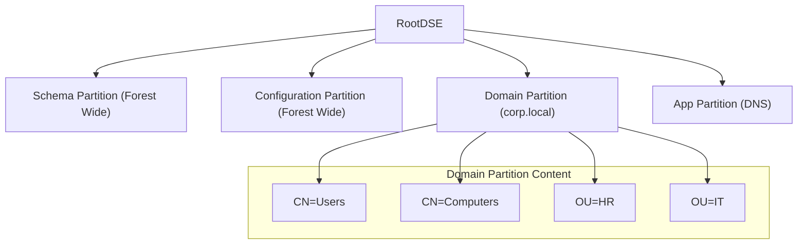


# Active Directory Structure: The Enterprise Backbone

## 1. Introduction
Active Directory Domain Services (AD DS) is the heart of the enterprise. It is an **Identity Provider (IdP)**, a **Resource Directory**, and a **Policy Enforcer**.

To attack or defend an enterprise, you must think in graphs. It is not about "hacking a server"; it is about finding the path of least resistance through permissions and trusts to reach the Domain Admin (DA) or Enterprise Admin (EA) group.

---

## 2. Logical Structure: The Hierarchy

### 2.1 The Forest (The Security Boundary)
*   **Definition**: The outermost container. A security boundary.
*   **Shared Components**:
    *   **Schema**: The definitions of objects (e.g., "A User has a First Name").
    *   **Configuration**: Replication topology and site definitions.
    *   **Global Catalog**: The index of all objects.
*   **Attack Implication**: If you compromise "Enterprise Admins", you own every domain in the forest. You cannot easily cross into a *different* forest without an explicit trust.

### 2.2 The Domain (The Administrative Boundary)
*   **Definition**: A partition of the forest.
*   **Role**: Handles authentication and authorization for users within it.
*   **Identifier**: SID (Security Identifier). E.g., `S-1-5-21-<DomainID>`.
*   **Attack Implication**: Owning "Domain Admins" gives you full control of *that domain*, but not necessarily others (unless paths exist).

### 2.3 Organizational Units (OUs)
*   **Definition**: Containers for objects.
*   **Purpose**:
    1.  **Group Policy**: Apply GPOs (Registry settings, scripts) to specific users/computers.
    2.  **Delegation**: Allow "Helpdesk" to reset passwords only in the "HR" OU.
*   **Hidden Containers**:
    *   `CN=Users`: The default container (NOT an OU, cannot apply GPOs directly).
    *   `CN=Computers`: Default for workstations.

### 2.4 Groups and Scoping (AGDLP)
Understanding group scope is vital for permission analysis.
1.  **Domain Local**: Used to assign permissions to resources (e.g., "File Share Read").
2.  **Global**: Used to group users (e.g., "HR Dept").
3.  **Universal**: Used across the forest.
*   **Strategy (AGDLP)**: **A**ccounts go into **G**lobal Groups, which go into **D**omain **L**ocal Groups, which get **P**ermissions.

---

## 3. Physical Structure: Replication & Sites

### 3.1 Sites and Subnets
*   **Site**: A high-speed LAN (e.g., "Headquarters").
*   **Subnet**: IP ranges mapped to a site.
*   **KCC (Knowledge Consistency Checker)**: Automatically generates the replication topology.
*   **Relevance**: Authentication attempts try to find a DC in the *same site* first. If an attacker is in a subnet not mapped to a site, auth might be slow or go to a random DC.

### 3.2 AD Partitions (Naming Contexts)
The AD Database (`NTDS.dit`) is split into partitions:
1.  **Schema Partition**: Definitions (Class `User`, Attribute `pwdLastSet`). Replicated Forest-wide.
2.  **Configuration Partition**: Topology. Replicated Forest-wide.
3.  **Domain Partition**: Actual objects (Users, Computers) for *that* domain.
4.  **Application Partition**: For DNS zones.

---

## 4. FSMO Roles (Flexible Single Master Operations)
AD is "Multi-Master" (you can change passwords on any DC), *except* for 5 specific tasks handled by single DCs.

### Forest-Wide Roles (1 per Forest)
1.  **Schema Master**: Controls updates to the schema (e.g., installing Exchange).
    *   *Attack*: Rarely targeted directly, but needed for persistence techniques involving schema modification.
2.  **Domain Naming Master**: Controls adding/removing domains.

### Domain-Wide Roles (1 per Domain)
3.  **PDC Emulator (Primary Domain Controller)**:
    *   **Most Critical Role**.
    *   Handles password changes (urgent replication).
    *   Time source for the domain.
    *   Target for GPO edits.
    *   *Attack*: If you DDoS the PDC, you lock out users and break auth.
4.  **RID Master (Relative ID)**:
    *   Allocates pools of RIDs (unique IDs) to other DCs so they can create new objects (SID = DomainSID + RID).
5.  **Infrastructure Master**:
    *   Handles references to objects in other domains (Phantoms).

---

## 5. Trusts and Federation

### 5.1 Trust Directions (The Arrow)
*   **Inbound Trust**: They trust us. (Access: Us -> Them).
*   **Outbound Trust**: We trust them. (Access: Them -> Us).
*   **Bidirectional**: Two-way.

### 5.2 Trust Types
*   **Parent-Child**: Implicit, Two-Way, Transitive.
*   **Shortcut**: Manually created to speed up auth between two distant child domains in the same forest.
*   **External**: Non-transitive trust to a legacy domain or separate entity.
*   **Forest**: Transitive trust between two modern forests.

### 5.3 SID Filtering (Quarantine)
*   **Concept**: Prevents "SID History Injection". When a user comes across a trust, the destination domain filters out SIDs that don't belong to the source domain.
*   **Attack**: If SID Filtering is *disabled*, an attacker in Child Domain can add the "Enterprise Admins" SID to their SID History and cross the trust to own the Parent.

---

## 6. Protocols & Authentication

### 6.1 LDAP (Lightweight Directory Access Protocol)
*   **Port**: 389 (TCP/UDP), 636 (SSL).
*   **Role**: Querying and modifying the database.
*   **Search Filters**:
    *   `(objectCategory=person)`
    *   `(servicePrincipalName=*)` -> **Kerberoasting** target.
    *   `(adminCount=1)` -> **High Value Target**.

### 6.2 Kerberos (The Guard Dog)
*   **Port**: 88 (TCP/UDP).
*   **Role**: Authentication (Ticket based).
*   **Key Concept**: You don't send your password; you send a Ticket (TGT/TGS) encrypted with shared secrets.

### 6.3 NTLM (The Legacy)
*   **Role**: Fallback authentication. Challenge-Response.
*   **Weakness**: Susceptible to Relay Attacks (SMBRelay) and Pass-the-Hash.

---

## 7. Red Team Operations: Mapping the Graph

### 7.1 BloodHound
BloodHound uses Graph Theory to find attack paths.
*   **Nodes**: Users, Computers, Groups, GPOs.
*   **Edges**: Relationships (MemberOf, CanRDP, HasSession, AdminTo).
*   **Query**: `MATCH p=(u:User)-[*]->(g:Group {name:'DOMAIN ADMINS@CORP.LOCAL'}) RETURN p`

### 7.2 PowerView / SharpHound
*   `Get-DomainUser -SPN`: Find Service Accounts.
*   `Get-DomainGroupMember "Domain Admins"`: List targets.
*   `Get-DomainTrustMapping`: Map the forest.

---

## 8. Practical Lab: Manual LDAP Mapping

**Goal**: Map the domain using only PowerShell (No external tools).

**1. Connect to AD**
```powershell
$Domain = [System.DirectoryServices.ActiveDirectory.Domain]::GetCurrentDomain()
Write-Host "Domain: $($Domain.Name)"
Write-Host "PDC: $($Domain.PdcRoleOwner.Name)"
```

**2. List Domain Controllers**
```powershell
$Domain.DomainControllers | Select-Object Name, IPAddress, SiteName
```

**3. Find All OUs**
```powershell
$Searcher = [adsisearcher]"(objectClass=organizationalUnit)"
$Searcher.FindAll() | ForEach-Object { $_.Path }
```

**4. Check for LAPS (Local Admin Password Solution)**
Check if the Schema has LAPS attributes.
```powershell
$Searcher = [adsisearcher]"(objectCategory=classSchema)"
$Searcher.Filter = "(lDAPDisplayName=ms-Mcs-AdmPwd)"
$Searcher.FindOne() 
# If this returns an object, LAPS is present in the Schema.
```

---

## 9. Diagrams (Mermaid)

### AD Partition Hierarchy



---

## 10. Summary & Checklist

*   **Structure**: Forest > Domain > OU.
*   **Trusts**: The bridges attackers cross. Watch for "Bidirectional" and "SID Filtering Disabled".
*   **Roles**: PDC is King. GC is the Map.
*   **Defense**: Implement **Tiered Administration**. Tier 0 (DCs) should never be accessed by Tier 1 (Server Admins) accounts.

**Next Step**: proceed to `04_Authentication_Protocols_Windows.md` to understand how Kerberos and NTLM actually work (and break).
