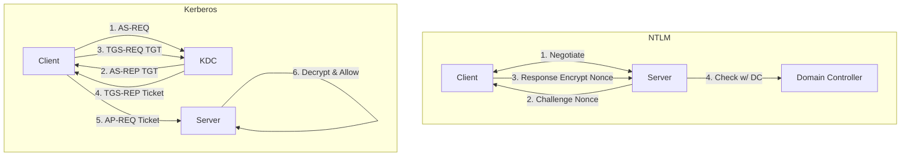
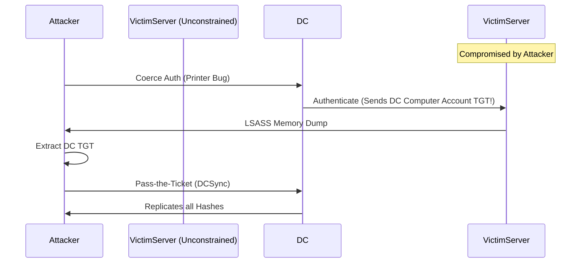


# Windows Authentication: The Protocols of Power

## 1. Introduction
In a Windows domain, "Identity" is everything. Windows relies on two primary protocols: **NTLM** (Legacy, messy, vulnerable) and **Kerberos** (Modern, strict, but fragile).

Understanding these protocols at the packet level is non-negotiable. Most AD attacks (Relaying, Kerberoasting, Golden Tickets, Delegation abuse) are not "exploits" in the traditional sense; they are **abuse of protocol features**.

---

## 2. NTLM (New Technology LAN Manager)

NTLM is a Challenge-Response protocol. It does *not* send passwords. It proves knowledge of the password hash.

### 2.1 Versions
1.  **LM (LanManager)**: Ancient. 7-character chunks. Trivial to crack. Disabled by default since Vista.
2.  **NTLMv1**: Uses MD4 hash of password + 8-byte challenge.
    *   **Vulnerability**: If you capture an NTLMv1 response, you can crack it to the NTLM Hash in seconds using DES tables (Rainbow Tables).
3.  **NTLMv2**: Uses HMAC-MD5.
    *   `HMAC-MD5(Username + Domain, PasswordHash)`
    *   Much harder to crack, but still vulnerable to **Relay**.

### 2.2 The Handshake (Network View)
1.  **Type 1 (Negotiate)**: Client -> Server. "I want to authenticate. I support 128-bit encryption."
2.  **Type 2 (Challenge)**: Server -> Client. "Here is a random 8-byte nonce (Server Challenge)."
3.  **Type 3 (Authenticate)**: Client -> Server. "Here is the math: `Encrypt(Challenge, MyHash)`."

### 2.3 Pass-the-Hash (PtH)
Since the server only needs the *Hash* to verify the math, you don't need the plaintext password.
*   **Scope**: Works for NTLM authentication. Does *not* work for Kerberos (mostly).
*   **Tools**: `Mimikatz`, `Impacket`, `CrackMapExec`.
    *   `crackmapexec smb 192.168.1.0/24 -u Administrator -H <NT_HASH>`

---

## 3. Kerberos: The Three-Headed Guard

Kerberos is stateless and ticket-based. It relies on a trusted third party (The KDC - Key Distribution Center).

### 3.1 Components
*   **KDC**: Lives on the Domain Controller. Consists of **AS** (Authentication Service) and **TGS** (Ticket Granting Service).
*   **Principal**: A user or service (`user@CORP.LOCAL`, `MSSQLSvc/db.corp.local`).
*   **Realm**: The Domain (`CORP.LOCAL`).

### 3.2 The "Double Encrypted" Dance
The core security guarantee: "Only the KDC and the Target Service share a secret key."

#### Phase 1: Authentication (AS-REQ / AS-REP)
**Goal**: Get a TGT (Ticket Granting Ticket).
1.  **AS-REQ**: Client encrypts a timestamp with its **Password Hash**. Sends to KDC.
2.  **KDC**: Decrypts timestamp. If time is correct (prevents replay), user is valid.
3.  **AS-REP**: KDC sends back a **TGT**.
    *   **The TGT**: A blob encrypted with the **krbtgt** account's password hash. The Client *cannot* read this. It contains the user's SIDs (The PAC).

#### Phase 2: Service Request (TGS-REQ / TGS-REP)
**Goal**: Get a Service Ticket (ST) for a specific resource (e.g., File Share).
1.  **TGS-REQ**: Client sends the **TGT** + Authenticator to KDC. "I want to talk to `cifs/fileserver`."
2.  **KDC**: Decrypts TGT (using krbtgt key). Checks if valid.
3.  **TGS-REP**: KDC creates a **Service Ticket**.
    *   **The ST**: Encrypted with the **Computer Account Hash** of `fileserver`.
    *   KDC gives ST to Client.

#### Phase 3: Access (AP-REQ)
1.  **AP-REQ**: Client sends **ST** to `fileserver`.
2.  `fileserver`: Decrypts ST (using its own computer account hash). Sees User SIDs. Grants access.

---

## 4. Advanced Kerberos Mechanics

### 4.1 The PAC (Privilege Attribute Certificate)
Inside the Ticket (TGT and ST), there is a data structure called the PAC.
*   **Contents**: User RID, Group RIDs (Domain Admins, etc.).
*   **Signature**: Signed by the KDC.
*   **Vulnerability (MS14-068)**: In older Windows, you could forge a PAC, lie about your groups, and trick the KDC into signing it. (Golden Ticket is forging the *entire* ticket, not just the PAC).

### 4.2 Delegation (The "Double Hop" Issue)
If User A connects to WebServer B, and WebServer B needs to query SQLServer C on User A's behalf... B needs to "Delegate" A's credentials.

1.  **Unconstrained Delegation**:
    *   **Mechanic**: DC places user's *TGT* inside the Service Ticket sent to Server B.
    *   **Risk**: Server B keeps a copy of User A's TGT in memory.
    *   **Attack**: If an attacker compromises Server B, and a Domain Admin connects to it (e.g., via CIFS), the attacker steals the DA's TGT. Game Over. (Common vector: The "Printer Bug" coerces a DC to connect to you).

2.  **Constrained Delegation (Classic)**:
    *   **Mechanic**: Server B is allowed to request tickets *only* for SQLServer C. Relies on S4U2Self and S4U2Proxy extensions.
    *   **Risk**: If attacker has local admin on Server B, they can impersonate *any user* to SQLServer C.

3.  **Resource-Based Constrained Delegation (RBCD)**:
    *   **Mechanic**: SQLServer C says "I allow Server B to delegate to me". (Configured on the target, not the source).
    *   **Attack**: If you have `GenericWrite` on a Computer Object, you can configure RBCD to allow *yourself* to impersonate Admin to that computer.

---

## 5. Offensive Protocols

### 5.1 Kerberoasting (Attacking Phase 2)
The **TGS-REP** contains a Service Ticket encrypted with the Service Account's NTLM Hash.
*   **Theory**: Any user can request a ticket for ANY service.
*   **Action**: Request ticket for `MSSQLSvc`. Receive encrypted blob. Brute force it offline.
*   **Protection**: Strong passwords for Service Accounts (25+ chars).

### 5.2 AS-REP Roasting (Attacking Phase 1)
If "Do not require Kerberos preauthentication" is set on a user.
*   **Theory**: KDC sends AS-REP (encrypted with user hash) without demanding the user verify their identity first.
*   **Action**: Send AS-REQ. Capture AS-REP. Brute force offline.

### 5.3 Golden Ticket (The KDC Key)
If you steal the NTLM hash of the `krbtgt` account.
*   **Action**: You can create TGTs offline.
*   **Features**:
    *   Set user to "NonExistentUser".
    *   Set groups to "512" (Domain Admins), "519" (Enterprise Admins).
    *   Set duration to 10 years.
    *   **Persistence**: Even if the user changes their password, your Golden Ticket is valid (because it's signed by `krbtgt`, not the user).

---

## 6. Diagrams (Mermaid)

### NTLM vs Kerberos

### Delegation Attack Flow (Unconstrained)

---

## 7. Operational Checklist

### Red Team
1.  **Scan for Pre-Auth Disabled**: `Get-DomainUser -PreauthNotRequired`.
2.  **Scan for Unconstrained Delegation**: `Get-DomainComputer -Unconstrained`. (High Priority Target).
3.  **Check SMB Signing**: If `False`, Relay is possible.

### Blue Team
1.  **Enforce AES**: Disable RC4 in Group Policy.
2.  **Protected Users Group**: Add Admins here. It forces Kerberos (No NTLM) and prevents delegation.
3.  **Detect Overpass-the-Hash**: Look for Event 4768 (TGT Request) with Encryption Type `0x17` (RC4) if your policy is AES.

---

## 8. References
- [[06_Active_Directory_Attacks/03_Kerberos_Attacks]]
- [[06_Active_Directory_Attacks/06_Delegation_Attacks]]
- [[07_Cryptography/01_Hashing_vs_Encryption]]

# End of Document
