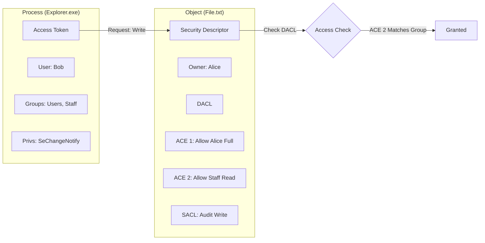


# Windows Permissions: The Keys to the Kingdom

## 1. Introduction
In Windows, "Security" is defined by **Objects**. Every object (File, Registry Key, Process, Service, Printer) has a **Security Descriptor (SD)**.

For an attacker, the SD is the map. It tells you where the weak points are. A single misconfigured ACE (Access Control Entry) allows a standard user to become SYSTEM.

---

## 2. The Security Descriptor Architecture

### 2.1 Anatomy of a Security Descriptor
1.  **Owner (SID)**: The user who "owns" the object. Owners can *always* change permissions (WRITE_DAC), even if the DACL denies them access.
2.  **Primary Group (SID)**: Mostly for POSIX compatibility, rarely used in Windows security decisions.
3.  **DACL (Discretionary Access Control List)**: The "Who can do what" list.
4.  **SACL (System Access Control List)**: The "Who gets audited" list.

### 2.2 DACL vs. SACL
*   **DACL**: If there is no DACL (NULL DACL), *everyone* has full access. If there is an empty DACL, *no one* has access.
*   **SACL**: Used for Blue Team detection. Example: "Log event 4663 when 'Everyone' tries to 'Write' to `sensitive.txt`."

### 2.3 ACE (Access Control Entry)
Each line in an ACL is an ACE. It has:
*   **Type**: Allow (A) or Deny (D).
*   **Trustee**: The User/Group (e.g., Bob, Administrators).
*   **Access Mask**: The specific rights (Read, Write, Execute, Delete, ChangePermissions, TakeOwnership).
*   **Inheritance**: `(OI)` Object Inherit, `(CI)` Container Inherit.

---

## 3. SDDL (Security Descriptor Definition Language)

Admins and Tools often see ACLs as cryptic text strings. You must learn to read this Matrix.

**Format**: `O:OwnerG:GroupD:(DACL_Flags)(ACE)(ACE)...S:(SACL_Flags)(ACE)...`

**Common SIDs**:
*   `BA`: Built-in Administrators
*   `SY`: Local System
*   `AU`: Authenticated Users
*   `WD`: Everyone (World)
*   `IU`: Interactive Users

**Access Rights**:
*   `GA`: Generic All (Full Control)
*   `GR`: Generic Read
*   `GW`: Generic Write
*   `GX`: Generic Execute
*   `WD`: Write DAC (Change Permissions) - **CRITICAL**
*   `WO`: Write Owner (Take Ownership) - **CRITICAL**

**Example Decoding**:
`D:(A;;GA;;;BA)(A;;GR;;;AU)`
*   `D:`: This is the DACL.
*   `(A;;GA;;;BA)`: **A**llow **G**eneric **A**ll (Full Control) to **B**uilt-in **A**dmin.
*   `(A;;GR;;;AU)`: **A**llow **G**eneric **R**ead to **A**uthenticated **U**sers.

---

## 4. Privileges (User Rights Assignment)

"Permissions" control access to Objects. "Privileges" control access to System Tasks.
Privileges are assigned to Users (tokens), not Objects.

### 4.1 The "God Mode" Privileges
If you find a user with these, you are essentially SYSTEM.

1.  **SeImpersonatePrivilege** (Potato Exploits):
    *   **Power**: Can impersonate any client that connects to a pipe created by this process.
    *   **Exploit**: Use `JuicyPotato`, `RoguePotato`, or `PrintSpoofer` to coerce SYSTEM to connect to you -> Get SYSTEM token.
    *   **Who has it?**: IIS AppPools, SQL Server Service.

2.  **SeDebugPrivilege**:
    *   **Power**: Can bypass security checks to open *any* process (even SYSTEM ones like lsass.exe).
    *   **Exploit**: Dump `lsass.exe` to steal hashes.
    *   **Who has it?**: Administrators (usually).

3.  **SeBackupPrivilege / SeRestorePrivilege**:
    *   **Power**: Can read/write *any* file, ignoring ACLs (for backup purposes).
    *   **Exploit**: Read `C:\Windows\System32\config\SAM` or write a DLL to `System32`.
    *   **Who has it?**: Backup Operators.

4.  **SeTakeOwnershipPrivilege**:
    *   **Power**: Can take ownership of any object.
    *   **Exploit**: Take ownership of a Service binary -> Change ACL to allow yourself Write -> Overwrite binary -> SYSTEM.

---

## 5. Enumeration & Exploitation (Red Team)

### 5.1 Tools of the Trade
*   **icacls**: Built-in. Good for quick checks.
    *   `icacls C:\Windows\System32\config\SAM`
*   **Get-Acl (PowerShell)**: Powerful object parsing.
    *   `(Get-Acl C:\path).Access`
*   **AccessChk (Sysinternals)**: The Gold Standard.
    *   `accesschk64.exe -wvu "Everyone" *` (Find everything Everyone can Write).
*   **WinPEAS**: Automates looking for "Interesting Permissions".

### 5.2 Common Misconfigurations

#### A. Modifiable Service Binaries
*   **Scan**: `accesschk64.exe -w "Authenticated Users" -c *`
*   **Finding**: Users have `FILE_WRITE_DATA` or `DELETE` on `C:\Program Files\Vendor\Service.exe`.
*   **Attack**: Rename real .exe, copy payload to .exe, restart service (or reboot).

#### B. Modifiable Service Registry Keys
*   **Scan**: `accesschk64.exe -kv "Authenticated Users" HKLM\System\CurrentControlSet\Services`
*   **Finding**: Users have `KEY_SET_VALUE` on a Service Key.
*   **Attack**: Change `ImagePath` to `C:\Temp\payload.exe`.

#### C. AlwaysInstallElevated
*   **Scan**: Check registry keys in HKLM and HKCU.
*   **Finding**: Both set to 1.
*   **Attack**: Build an MSI (`msfvenom -f msi`). Run it. It installs as SYSTEM.

---

## 6. Practical Lab: Permission Surgery

### Scenario: SeBackupPrivilege Abuse
You have a shell as "BackupUser". `whoami /priv` shows `SeBackupPrivilege`.

**Step 1: Create a DSH (Distributed Shell)**
We cannot just `type` the file. We must use the Win32 API flag `FILE_FLAG_BACKUP_SEMANTICS`.
A specialized tool is often needed, or a PowerShell script.

**Step 2: Copy SAM and SYSTEM (Conceptual)**
```powershell
# Using a tool like Robocopy (which supports /b for Backup Mode)
robocopy /b C:\Windows\System32\config . SAM
robocopy /b C:\Windows\System32\config . SYSTEM
```

**Step 3: Extract Hashes**
Download files and run `secretsdump.py -sam SAM -system SYSTEM LOCAL`.

---

## 7. Diagrams (Mermaid)

### Access Token vs Security Descriptor



---

## 8. Critical Analysis

### Canonical Ordering
Windows enforces a specific order for ACEs in the DACL:
1.  Explicit Deny
2.  Explicit Allow
3.  Inherited Deny
4.  Inherited Allow
**Why?** To ensure a Deny always overrides an Allow.
**Exploit**: If you write your own DACL (via C++) and mess up the order (put Allow before Deny), you can create "Canonicalization Errors" which might bypass security controls or confuse the OS.

### Interview Questions
1.  **Q**: If I remove a user from a group, do they lose access immediately?
    -   **A**: No. The Access Token is generated *at logon*. They must log off and back on to update their token (unless you purge the TGT in a Kerberos environment, but local tokens persist).
2.  **Q**: What is the difference between `icacls /grant` and `icacls /edit`?
    -   **A**: `/grant` adds a new ACE (merges). `/edit` modifies existing ones. Be careful not to use `/setowner` or `/reset` blindly, or you might lock everyone out.

---

## 9. References
- [[09_Windows_Privilege_Escalation]]
- [[02_PowerShell_Offensive_Defensive]]

# End of Document
