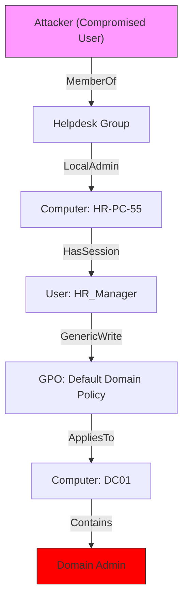


# Active Directory Enumeration: Mapping the Battlefield

## 1. Introduction
**"If you know the enemy and know yourself, you need not fear the result of a hundred battles."** - Sun Tzu.

In Active Directory, the "Enemy" is the graph of permissions, groups, and sessions. Enumeration is not an attack; it is **Information Gathering**. By default, any Authenticated User (even a temp employee) has "Read" access to almost the entire directory. We use this to map the path to the Crown Jewels (Domain Admin).

### Why do we Enumerate?
*   **Beginner View**: To find a list of usernames to brute force.
*   **Expert View**: To find structural weaknesses (Misconfigurations, Trusts, Delegation) that allow us to bypass authentication entirely.

---

## 2. Core Concepts: The Query Languages

### 2.1 LDAP (Lightweight Directory Access Protocol)
AD is a database. LDAP is SQL for AD.
*   **Filter Syntax**: `(Attribute=Value)`
    *   `(&(objectClass=user)(sAMAccountName=admin*))` -> "Find users whose name starts with admin".
*   **Attributes to Watch**:
    *   `sAMAccountName`: The login username.
    *   `description`: Often contains passwords ("Service Account for Backup. Pass: Winter2020!").
    *   `adminCount=1`: Indicates a high-value target (Protected Group).
    *   `servicePrincipalName`: Indicates the account runs a service (Target for Kerberoasting).

### 2.2 The "Session" Concept
Knowing *who* exists is easy. Knowing *where* they are is hard.
*   **The Goal**: Find a machine where a "Domain Admin" is currently logged in.
*   **The Pivot**: If we compromise that machine, we can steal their credentials from memory (LSASS).

---

## 3. Toolset Deep Dive

### 3.1 PowerView / SharpView
The standard for manual enumeration. It wraps .NET LDAP functions into PowerShell cmdlets.

**Key Cmdlets**:
1.  **Domain Info**:
    *   `Get-NetDomain`: Policies, Domain Controller names.
    *   *Look for*: `LockoutThreshold: None` (Unlimited Brute Force!).
2.  **User Info**:
    *   `Get-NetUser -UACFilter NOT_ACCOUNTDISABLE`: List active users.
    *   `Get-NetUser -SPN`: Find Kerberoastable accounts.
3.  **Group Info**:
    *   `Get-NetGroupMember "Domain Admins" -Recurse`: Who is an admin? (Recurse unrolls nested groups).
4.  **Computer Info**:
    *   `Get-NetComputer -OperatingSystem "*Server 2016*"`: Find servers.
5.  **Trusts**:
    *   `Get-NetDomainTrust`: Find paths to other domains.

### 3.2 BloodHound (The Graph)
BloodHound automates the logic of "If User A is Admin on Computer B, and Computer B has a session for User C..."
*   **SharpHound.exe (The Collector)**: Runs on the victim. Crawls LDAP, asks computers "Who is logged in?", checks ACLs.
*   **Neo4j (The Database)**: Stores the data.
*   **GUI (The Visualizer)**: Shows the "Attack Path".

**Critical Edges in BloodHound**:
*   **MemberOf**: Direct group membership.
*   **AdminTo**: The user is a Local Admin on the target computer.
*   **HasSession**: The user is logged in on the target computer.
*   **ForceChangePassword**: The user can reset the target's password.
*   **GenericAll**: Full Control over the object.

### 3.3 ADModule (Living off the Land)
If you cannot drop `PowerView.ps1` (AV blocks it), use the Microsoft built-in RSAT tools if installed, or import the DLL.
*   `Get-ADUser -Filter * -Properties *`
*   `Get-ADPrincipalGroupMembership <User>`

---

## 4. Advanced Enumeration Techniques

### 4.1 ACL Enumeration (The Invisible Backdoor)
Sometimes, a low-level user has "Write" access to a GPO, or "Reset Password" access to an Admin.
*   **PowerView**: `Get-ObjectAcl -Identity "Domain Admins" -ResolveGUIDs`
*   **Look for**:
    *   `ActiveDirectoryRights : GenericAll`
    *   `ActiveDirectoryRights : WriteDacl`
    *   `ActiveDirectoryRights : WriteProperty` (Specifically on 'Member' attribute -> Add yourself to group).

### 4.2 Local Admin Enumeration (The Pivot)
How do we know if our compromised user is an Admin on *other* computers?
*   **Technique**: Try to access `Admin$` or `C$` shares on every computer in the subnet.
*   **PowerView**: `Find-LocalAdminAccess -Verbose`.
*   *Note*: This is noisy (Traffic to port 445 on all hosts).

### 4.3 Detecting Deception (Honeytokens)
*   **Honey Accounts**: Accounts that look juicy (`adm_sql`, `backup_svc`) but have no real privileges.
*   **Detection**: Check the `logonCount` attribute. A real admin account will have thousands of logons. A honey account will have 0 (or very few).
*   **Action**: `Get-NetUser | Select-Object samaccountname, logoncount`

---

## 5. Practical Lab: Manual Reconnaissance

### Scenario: "The Silent Scout"
You have a shell. You want to map the network without triggering IDS/IPS. No BloodHound. No port scanning.

**Step 1: Check Current User & Groups**
```powershell
whoami /all
net user /domain %USERNAME%
```

**Step 2: Map the Domain Controllers**
```powershell
# Built-in way
nltest /dclist:corp.local

# PowerView way
Get-NetDomainController
```

**Step 3: Find User Descriptions (Poor Man's Password Vault)**
Users often write passwords in the description field.
```powershell
# PowerView
Get-NetUser -Properties description | Where-Object {$_.description -ne $null}
```

**Step 4: Find File Servers**
File servers are high-value targets (sensitive data).
```powershell
Get-NetFileServer
# OR query SPNs
Get-NetUser -SPN | ? { $_.serviceprincipalname -like "cifs*" }
```

---

## 6. Diagrams (Mermaid)

### The BloodHound "Shortest Path" Logic



**Explanation**:
1.  Attacker is in Helpdesk.
2.  Helpdesk is Admin on HR-PC-55.
3.  We pivot to HR-PC-55 and dump memory. We find HR_Manager's hash.
4.  HR_Manager has Write access to a GPO.
5.  We edit the GPO to add a malicious startup script.
6.  The DC applies the GPO and runs our script as SYSTEM. Game Over.

---

## 7. Critical Analysis

### The Noise Factor
*   **Silent**: `net user /domain` (Queries DC, looks like normal login traffic).
*   **Loud**: `Find-LocalAdminAccess` (Touches every PC).
*   **Deafening**: `Invoke-BloodHound` (Queries *everything*, touches *every* PC if Session Loop is enabled).

### Defensive Countermeasures
*   **SAMR Hardening**: Restrict who can query remote users/groups via SAMR protocol (Registry/GPO).
*   **User Hunters**: Monitor for "User Enumeration" (Event 4798/4799) from non-admin workstations.

---

## 8. References
- [[02_PowerShell_Offensive_Defensive]]
- [[08_Group_Policy_Objects]]
- [[09_Windows_Privilege_Escalation]]

# End of Document
