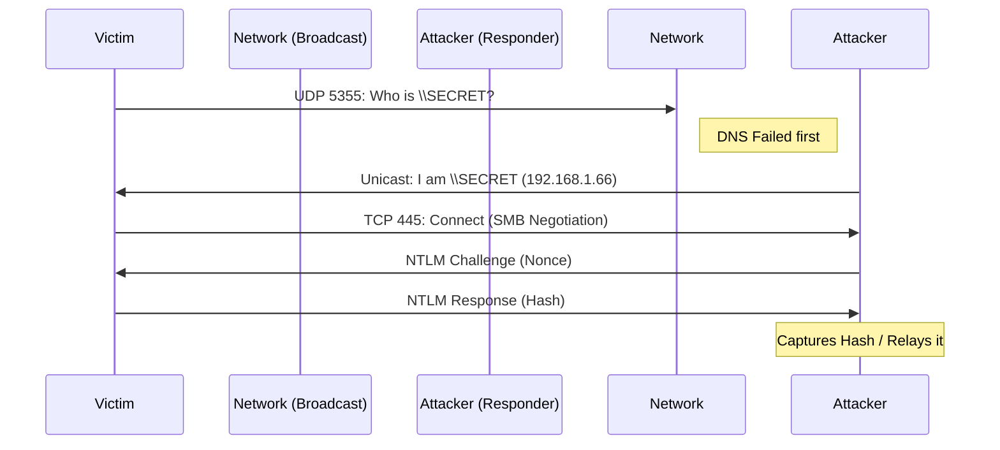


# Credential Harvesting: LLMNR, NTLM & IPv6

> **Executive Summary**: Before you can attack Kerberos or move laterally, you need credentials. The easiest way to get them in an internal network is to listen. Windows devices are "chatty"; they constantly broadcast queries to find file servers and printers. By answering these queries (poisoning), we can trick victims into authenticating to us, capturing their NTLMv2 hashes.

## 1. Learning Objectives
By the end of this chapter, you will be able to:
- **Master Responder**: Configure and run `Responder.py` to capture hashes.
- **Understand the Protocol**: Explain LLMNR and NBT-NS poisoning.
- **Relay Attacks**: Use `ntlmrelayx.py` to pivot without cracking hashes.
- **IPv6 DNS Takeover**: Exploit DHCPv6 to become the primary DNS server (`mitm6`).

## 2. Core Concepts: The Chatty Network

### 2.1 LLMNR & NBT-NS
When DNS fails (e.g., user types `\\printserver` instead of `\\printserver.corp.local`), Windows falls back to broadcast protocols:
1.  **LLMNR (Link-Local Multicast Name Resolution)**: UDP/5355. "Hey local network, who is 'printserver'?"
2.  **NBT-NS (NetBIOS Name Service)**: UDP/137. "Hey broadcast, who is 'printserver'?"

**The Vulnerability**: These protocols are unauthenticated. Any device can reply "I am printserver".

### 2.2 WPAD (Web Proxy Auto-Discovery)
Browsers ask "Where is the proxy configuration file (`wpad.dat`)?".
- If DNS fails, they use LLMNR.
- Attackers reply, serve a malicious PAC file, and inspect all HTTP traffic (including NTLM auth headers).

## 3. Deep Dive: The Attack Tools

### 3.1 Responder (`Responder.py`)
The industry standard.
- **Poisoners**: LLMNR, NBT-NS, MDNS.
- **Servers**: Starts rogue SMB, MSSQL, HTTP, LDAP servers.
- **Action**:
    1.  Victim shouts "Who is FILESERVER?"
    2.  Responder says "I am! Connect to me."
    3.  Victim connects to Responder's rogue SMB server.
    4.  Responder sends NTLM Challenge.
    5.  Victim sends NTLMv2 Hash.
    6.  Responder prints Hash.

### 3.2 Inveigh (PowerShell/C#)
The Windows equivalent of Responder. Useful if you have a foothold on a Windows machine and want to poison from inside (avoiding network-level detection of a new Linux device).

## 4. Deep Dive: IPv6 Attacks (`mitm6`)

### 4.1 The IPv6 Blindspot
Most orgs ignore IPv6 but leave it enabled. Windows prefers IPv6 over IPv4.
- **Attack**:
    1.  Run `mitm6`. It listens for DHCPv6 Solicit messages.
    2.  Reply with a DHCPv6 Advertise.
    3.  Assign the Victim an IPv6 address and set **DNS Server** to the Attacker's IP.
    4.  **Result**: You are now the DNS server for the victim.
    5.  **Pivot**: When victim asks for "wpad", answer with your IP. Force NTLM auth. Relay credentials to LDAP/SMB.

## 5. Red Team Perspective

### 5.1 Cracking vs Relaying
- **Cracking**: You get the hash. Run `hashcat -m 5600`. Good for offline usage.
- **Relaying**: You forward the hash to a target server (SMB Signing must be OFF). Good for immediate access.
    - `ntlmrelayx.py -tf targets.txt -smb2support`

### 5.2 Ghost Potato
Using the same concept locally to escalate privileges (see Chapter 09).

## 6. Blue Team Perspective

### 6.1 Mitigation
- **Disable LLMNR/NBT-NS**: GPO -> Computer Configuration -> Admin Templates -> Network -> DNS Client -> Turn off Multicast Name Resolution.
- **Disable IPv6**: If not used (careful, might break Exchange/AD components). Prefer configuring DHCPv6 Guard.
- **SMB Signing**: Enforce on all endpoints to stop Relaying.

### 6.2 Detection
- **Honeytokens**: Broadcast queries for fake names (`\\HONEYPOT-SERVER`). Alert if anyone answers.
- **Traffic Analysis**: Spike in UDP/5355 traffic from a single host.

## 7. Practical Lab: Responder & Hashcat

### Scenario: The Coffee Shop Attack
**Setup**: Kali (Attacker) and Windows 10 (Victim) on same LAN.

**Step 1: Start Responder**
```bash
sudo responder -I eth0 -dwv
```
- `-d`: DHCP (optional)
- `-w`: WPAD
- `-v`: Verbose

**Step 2: Trigger**
On Windows, open File Explorer and type `\\nonserver`.

**Step 3: Capture**
Responder output:
`[SMB] NTLMv2 Client   : 192.168.1.50`
`[SMB] Username        : CORP\Alice`
`[SMB] Hash            : Alice::CORP:112233...`

**Step 4: Crack**
Save hash to `hash.txt`.
```bash
hashcat -m 5600 hash.txt /usr/share/wordlists/rockyou.txt
```

## 8. Diagrams

### LLMNR Poisoning Flow



## 9. Critical Analysis

### Why does this still work in 2026?
Compatibility. Disabling legacy protocols breaks discovery of old printers and NAS drives. Admins fear breaking the network more than they fear the theoretical risk of poisoning.
**IPv6** is the modern vector because it bypasses IPv4 hardening.

### Interview Questions
1.  **Q**: Can you Relay NTLM to the same machine that sent it?
    -   **A**: No. MS08-068 patched NTLM Reflection. You cannot relay Alice's hash back to Alice's PC. You must relay to Bob's PC.
2.  **Q**: What is the difference between NTLMv1 and NTLMv2?
    -   **A**: NTLMv1 uses DES (weak) and is easily cracked. NTLMv2 uses HMAC-MD5 and is much harder (but still relayable).

## 10. References
- [[04_Windows_AD/04_Authentication_Protocols_Windows]]
- [[02_Networking/07_SMB_NetBIOS_and_RPC]]
