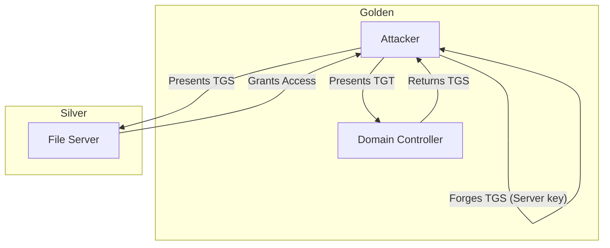


# Kerberos Attacks II: Golden & Silver Tickets

> **Executive Summary**: While Roasting attacks are for *Privilege Escalation*, Forgery attacks (Golden/Silver Tickets) are for *Persistence*. By stealing the master keys of the Kerberos protocol (`krbtgt` or Service keys), an attacker can generate valid tickets for any user, with any privileges, valid for years.

## 1. Learning Objectives
By the end of this chapter, you will be able to:
- **Forge Golden Tickets**: Create a TGT that grants Domain Admin rights indefinitely.
- **Forge Silver Tickets**: Create a Service Ticket to access specific services (CIFS, HTTP) without talking to the DC.
- **Understand PAC**: Explain the Privilege Attribute Certificate and how validation works.
- **Execute Diamond Tickets**: A newer, stealthier version of the Golden Ticket.

## 2. Core Concepts: The Keys

### 2.1 The KRBTGT Account
The KDC (Key Distribution Center) uses the password hash of the `krbtgt` account to sign/encrypt all TGTs (Ticket Granting Tickets).
- If you have the `krbtgt` hash, you *are* the KDC. You can issue TGTs for anyone.

### 2.2 Service Account Keys
Each service (Computer account, SQL account) uses its own hash to decrypt Service Tickets.
- If you have the Computer Account hash (`PC$`), you can forge a ticket for `CIFS/PC.domain` and become Admin on that PC.

### 2.3 The PAC (Privilege Attribute Certificate)
Inside the ticket, there is a field called PAC. It lists the user's SIDs (User SID + Group SIDs).
- **Validation**:
    - **Silver Ticket**: No PAC Validation (usually). The service blindly trusts the ticket.
    - **Golden Ticket**: The PAC is signed by the `krbtgt`. Since we have the key, we sign a fake PAC claiming we are in "Domain Admins".

## 3. Deep Dive: Golden Ticket (TGT Forgery)

### 3.1 Requirements
1.  **Domain Name**: `corp.local`
2.  **Domain SID**: `S-1-5-21-...`
3.  **KRBTGT Hash**: NTLM or AES key. (Dumped via DCSync or from ntds.dit).
4.  **User ID**: ID of the user to impersonate (usually 500 for Administrator, or a fake ID).

### 3.2 Execution (Mimikatz)
```cmd
kerberos::golden /user:FakeAdmin /domain:corp.local /sid:S-1-5... /krbtgt:[HASH] /id:500 /groups:512,513,518,519,520 /ptt
```
- `/ptt`: Pass-the-Ticket (Inject into current session).
- **Result**: You can now access `\\dc01\C$` as Admin.

### 3.3 Persistence
Golden Tickets can be set to be valid for **10 years**. Even if the user changes their password, the TGT is valid (because TGTs are signed by krbtgt, not the user).

## 4. Deep Dive: Silver Ticket (TGS Forgery)

### 4.1 Characteristics
- **Scope**: Limited to *one* service on *one* server.
- **Stealth**: **Does not communicate with the DC**. No logs on the DC (Event 4769).
- **Requirement**: NTLM hash of the Computer Account (`TargetPC$`).

### 4.2 Services to Target
- `cifs`: File access (C$).
- `host`: WMI / PsExec / Scheduled Tasks.
- `http`: WinRM (PowerShell Remoting).
- `mssql`: SQL Server.

### 4.3 Execution (Mimikatz)
```cmd
kerberos::golden /user:Admin /domain:corp.local /sid:S-1-5... /target:server.corp.local /service:cifs /rc4:[MachineHash] /ptt
```

## 5. Red Team Perspective

### 5.1 Diamond Ticket
Golden Tickets look fake. They don't exist in TGT history on the DC.
**Diamond Ticket**:
1.  Request a *valid* TGT for a normal user.
2.  Decrypt it (using krbtgt key).
3.  Modify the PAC (Add Domain Admins).
4.  Re-encrypt it.
**Result**: A valid-looking TGT with escalated privileges.

### 5.2 Skeleton Key
Instead of forging tickets, patch `lsass.exe` on the DC to accept a "Master Password" for any user. (Requires Domain Admin to install).

## 6. Blue Team Perspective

### 6.1 Detection
- **Golden**: Look for TGTs with strange lifetimes (default 10h). Look for ARC4 encryption if domain is AES. Look for blank User IDs.
- **Silver**: Hard to detect. Look for "Audit Failure" on the target machine if decryption fails.

### 6.2 Mitigation
- **Rotate KRBTGT**: Change the password twice. (Invalidates all Golden Tickets).
- **PAGed (Privileged Access Groups)**: Monitor group membership changes.
- **PAC Validation**: Enforce `ValidateKdcPacSignature` registry key (prevents some Silver Ticket attacks).

## 7. Practical Lab: Forging a Ticket

### Scenario: The Backup
You found a backup of `ntds.dit` and extracted the `krbtgt` hash.

**Step 1: Get Domain SID**
```powershell
Get-ADDomain | Select DomainSID
```

**Step 2: Mimikatz Golden**
On a compromised workstation:
```cmd
mimikatz # kerberos::golden /domain:lab.local /sid:S-1-5-21-LAB /krbtgt:HASH /user:Backdoor /groups:512 /ptt
```

**Step 3: Verify**
```cmd
klist
dir \\dc01\c$
```

## 8. Diagrams

### Ticket Forgery Comparison

| Feature | Golden Ticket | Silver Ticket |
| :--- | :--- | :--- |
| **Key Needed** | `krbtgt` hash | Service Account hash |
| **Type** | TGT (Ticket Granting Ticket) | TGS (Service Ticket) |
| **Scope** | Entire Domain (All Services) | Specific Service (e.g., CIFS on Server1) |
| **DC Interaction** | None (to create). Yes (to use). | **None**. (Offline). |
| **PAC Validation** | Forged (Signed by us). | Skipped/Ignored. |



## 9. Critical Analysis

### The "Constraint Delegation" Link
Silver Tickets are powerful, but limited. However, if you forge a Silver Ticket for `http` service (WinRM) on a DC, you are effectively Domain Admin, because the DC *is* the domain.

### Interview Questions
1.  **Q**: How often should you rotate the `krbtgt` password?
    -   **A**: Microsoft recommends every 180 days. Most orgs never do it because they fear breaking replication.
2.  **Q**: Can you use a Silver Ticket to access the file system if you target the `http` service?
    -   **A**: No. `http` allows WinRM/IIS access. `cifs` allows file access. You must forge the ticket for the specific service you want (or forge multiple tickets).

## 10. References
- [[06_Active_Directory_Attacks/02_Kerberos_Attacks_I]]
- [[04_Windows_AD/10_Windows_Persistence_Mechanisms]]
