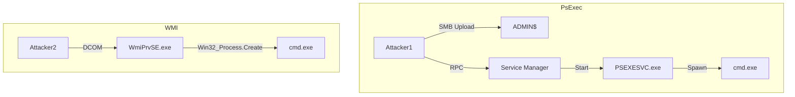


# Lateral Movement Techniques: Moving Through the Network

> **Executive Summary**: You have credentials (password or hash) for a user who is an Admin on a target machine. How do you execute code on that target? Lateral Movement covers the techniques to turn "Authentication" into "Remote Code Execution" (RCE).

## 1. Learning Objectives
By the end of this chapter, you will be able to:
- **PsExec**: Move via SMB/RPC Service creation.
- **WMI**: Execute stealthy commands via WMI Object Methods.
- **WinRM**: Use PowerShell Remoting (TCP/5985).
- **DCOM**: Abuse Distributed COM for lateral movement.
- **RDP**: Hijack Remote Desktop sessions.

## 2. Core Concepts: The Requirements

### 2.1 The Admin Share (`ADMIN$`)
Windows shares `C:\Windows` as `ADMIN$`. Only Local Admins can access it.
- Most lateral movement tools upload a binary here first.

### 2.2 File and Printer Sharing
Required for SMB-based attacks. TCP/445 must be open.

### 2.3 Credentials
You need a Plaintext Password OR an NTLM Hash (Pass-the-Hash) OR a Kerberos Ticket (Pass-the-Ticket).

## 3. Deep Dive: Techniques

### 3.1 PsExec (The Classic)
**Mechanism**:
1.  Connect to `ADMIN$` share.
2.  Upload `PSEXESVC.exe`.
3.  Connect to Service Control Manager (RPC).
4.  Create and Start service.
5.  Service runs command.
**Tool**: Sysinternals PsExec (Signed, but flagged) or Impacket `psexec.py`.

### 3.2 WMI (Windows Management Instrumentation)
**Mechanism**:
1.  Connect to DCOM/RPC (TCP 135).
2.  Instantiate `Win32_Process` class.
3.  Call `Create()` method.
**Pros**: No file upload needed. No service created. Stealthier.
**Tool**: Impacket `wmiexec.py` or `Invoke-WmiMethod`.

### 3.3 WinRM (Windows Remote Management)
**Mechanism**:
1.  Connect to TCP 5985 (HTTP) or 5986 (HTTPS).
2.  Uses SOAP/XML protocol.
3.  Spawns a PowerShell session (wsmprovhost.exe).
**Pros**: Standard protocol for servers. Firewall friendly (looks like Web).
**Tool**: `Evil-WinRM`, `Enter-PSSession`.

### 3.4 DCOM (Distributed COM)
Abusing Excel or Outlook objects remotely.
- **Method**: Connect to `MMC20.Application` object on target. Call `ExecuteShellCommand`.
- **Result**: RCE via existing DCOM objects.

## 4. Red Team Perspective

### 4.1 Pass-the-Hash (PtH)
You don't need the password.
- **Impacket**: `wmiexec.py -hashes :[NTHash] user@target`.
- **Evil-WinRM**: `-H [NTHash]`.
- **Mimikatz**: `sekurlsa::pth`.

### 4.2 RDP Hijacking
If you are SYSTEM on a box, and "Alice" is logged in via RDP (Active or Disconnected):
- **Attack**: `tscon [SessionID] /dest:[MySessionName]`.
- **Result**: You switch into Alice's desktop *without* a password.

## 5. Blue Team Perspective

### 5.1 Detection
- **PsExec**: Service creation "PSEXESVC" (Event 7045).
- **WMI**: Process creation `WmiPrvSE.exe` spawning `cmd.exe`.
- **WinRM**: Event logs `Microsoft-Windows-WinRM/Operational`.

### 5.2 Prevention
- **LAPS (Local Admin Password Solution)**: Ensures every computer has a unique random Local Admin password. Stops lateral movement via shared local accounts.
- **Firewall**: Block 445/135 workstation-to-workstation.

## 6. Practical Lab: Moving without a Password

### Scenario: Pivot to the DC
You have the NTLM hash of the `Administrator` account. Target is `192.168.1.10` (DC).

**Method 1: WMI Exec (Impacket)**
```bash
wmiexec.py -hashes :[HASH] Administrator@192.168.1.10
```
*Output*: A semi-interactive shell.

**Method 2: Evil-WinRM**
```bash
evil-winrm -i 192.168.1.10 -u Administrator -H [HASH]
```
*Output*: A PowerShell shell.

**Method 3: PsExec (Manual)**
```bash
# Upload nc.exe
smbclient //192.168.1.10/ADMIN$ -U Administrator --pw-nt-hash [HASH] -c 'put nc.exe'
# Execute via Service
# (Requires sc.exe access or winexe)
```

## 7. Diagrams

### PsExec vs WMI



## 8. Critical Analysis

### The "UAC" Barrier
Remote Lateral Movement usually creates a "High Integrity" (Admin) session automatically (except WinRM sometimes). Local UAC restrictions don't apply to network logins in the same way. However, `LocalAccountTokenFilterPolicy` registry key determines if local accounts (non-domain) can do remote admin tasks. If `0` (default), PtH with local admin fails.

### Interview Questions
1.  **Q**: Why does `psexec` trigger Antivirus so easily?
    -   **A**: Because `PSEXESVC.exe` is a known signature. Also, the pattern of writing an EXE to `ADMIN$` and immediately starting a service is a very distinct heuristic behavior.
2.  **Q**: Can you use WinRM with a Local Account?
    -   **A**: By default, no (only Domain Admins). You must enable `LocalAccountTokenFilterPolicy` or add the local user to the Remote Management Users group.

## 9. References
- [[04_Windows_AD/07_SMB_NetBIOS_and_RPC]]
- [[04_Windows_AD/06_Windows_Services_Processes]]
