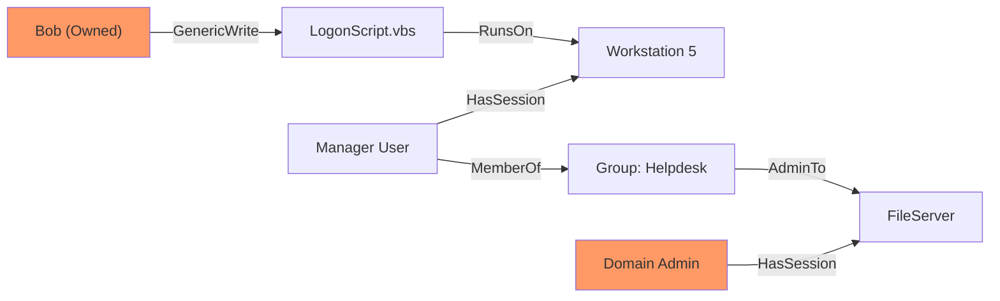


# BloodHound Analysis: Thinking in Graphs

> **Executive Summary**: BloodHound revolutionized AD security by shifting the focus from "Lists" (Users, Computers) to "Graphs" (Relationships). It reveals hidden attack paths like "User A has Password Reset on User B, who is Admin on Server C, where Domain Admin D has a session." This chapter teaches you to think in edges and nodes.

## 1. Learning Objectives
By the end of this chapter, you will be able to:
- **Collect Data**: Run `SharpHound` safely and stealthily.
- **Analyze Paths**: Use pre-built queries ("Shortest Path to DA") and custom Cypher queries.
- **Understand Edges**: Explain `AdminTo`, `MemberOf`, `HasSession`, `ForceChangePassword`, `GenericAll`.
- **Execute the Path**: Translate a BloodHound graph into a concrete attack plan.

## 2. Core Concepts: The Graph

### 2.1 Nodes & Edges
- **Nodes**: Objects (User, Computer, Group, GPO, OU).
- **Edges**: Relationships (The verb). `User -> MemberOf -> Group`.

### 2.2 Collection (SharpHound)
The collector queries the DC and maps the network.
- **Loop**: `CollectionMethods` (Group, LocalAdmin, Session, ACL).
- **Session Enum**: Connects to each computer to ask "Who is logged in?". (Noisiest part).

### 2.3 The Database (Neo4j)
A Graph Database backend. BloodHound GUI queries Neo4j.

## 3. Deep Dive: Critical Edges

### 3.1 AdminTo
User is in the local Administrators group of the computer.
- **Attack**: PsExec, WMI, RDP. Dump LSASS.

### 3.2 HasSession
User is logged on to the computer.
- **Attack**: If you are AdminTo the computer, you can steal the user's token or credentials (LSASS).

### 3.3 MemberOf
Group membership.
- **Transitive**: User -> Group A -> Group B -> Domain Admins.

### 3.4 ACL Edges (The Good Stuff)
- **ForceChangePassword**: You can set the user's password without knowing the old one.
- **GenericAll**: Full Control. Change password, modify group membership, etc.
- **WriteDacl**: You can grant yourself `GenericAll`.
- **AddMember**: You can add yourself to the group.

## 4. Red Team Perspective

### 4.1 Planning the Route
Don't just look for "Shortest Path to DA".
Look for "Shortest Path from **Owned Principals**".
1.  Mark your compromised user as "Owned".
2.  Query: "Shortest Path from Owned to Domain Admins".

### 4.2 Custom Cypher Queries
The GUI has limits. Use Cypher (SQL for Graphs).
**Find all admins**:
```cypher
MATCH (u:User)-[:AdminTo]->(c:Computer) RETURN u.name, c.name
```
**Find Kerberoastable Admins**:
```cypher
MATCH (u:User)-[:MemberOf*1..]->(g:Group)
WHERE g.name CONTAINS "ADMIN" AND u.hasspn=true
RETURN u.name
```

## 5. Blue Team Perspective

### 5.1 Running BloodHound Defensively
You cannot fix what you cannot see. Run BloodHound.
- **Identify Chokepoints**: Is "Domain Users" admin on 50% of workstations? Fix that GPO.
- **Tier 0 Analysis**: Who can control the Domain Admins group? It should only be other Tier 0 accounts.

### 5.2 Detection
- **SharpHound Binary**: Signature detection.
- **Traffic**: Massive LDAP queries + Connections to IPC$ on 1000 hosts (Session Enum).
- **Honeypots**: Create a fake path to DA that triggers an alert if touched.

## 6. Practical Lab: Executing a Path

### Scenario: The ACL Attack
**Graph**: `Bob -> ForceChangePassword -> Alice -> AdminTo -> DC`.
**You are**: Bob.

**Step 1: Execute Edge 1**
Reset Alice's password.
```bash
rpcclient -U Bob -c "setuserinfo2 Alice 23 'NewPass123!'" DC01
```
(Or use `net user` / PowerShell).

**Step 2: Execute Edge 2**
Log in as Alice to the DC.
```bash
evil-winrm -u Alice -p 'NewPass123!' -i DC01
```

**Step 3: Victory**
Dump NTDS.

## 7. Diagrams

### A Complex Attack Path


**Interpretation**:
1. Edit Script.
2. Wait for PC to run it.
3. Compromise PC. Steal Manager creds.
4. Use Manager creds to Admin FileServer.
5. Steal DA creds from FileServer.

## 8. Critical Analysis

### The "Stale Data" Problem
BloodHound is a snapshot.
- "HasSession" edges are transient. If the DA logs off, the path breaks.
- **Red Team**: Move fast on Session edges. ACL edges are permanent.

### Interview Questions
1.  **Q**: What is "Object Takeover"?
    -   **A**: Abusing ACLs (like GenericWrite) to modify an object (User/Group/Computer) to gain control over it.
2.  **Q**: How can you collect BloodHound data without running the binary on disk?
    -   **A**: Run SharpHound via `execute-assembly` (Cobalt Strike) or load it into PowerShell memory (AMSI bypass required). Or run the Python ingestor (`bloodhound-python`) from a Linux box (requires valid creds).

## 9. References
- [[07_Active_Directory_Enumeration]]
- [[05_Windows_Permissions_ACLs]]
