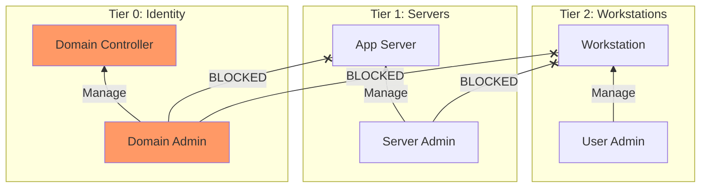


# AD Forest Recovery & Defense: Tier Models

> **Executive Summary**: Hacking AD is fun, but securing it is the job. The Microsoft **Enterprise Access Model (Tier Model)** is the gold standard for stopping lateral movement. By segregating identities into Tiers (0, 1, 2), we ensure that a compromise of a workstation does not lead to a compromise of the Identity Provider.

## 1. Learning Objectives
By the end of this chapter, you will be able to:
- **Design Tiers**: Define Tier 0 (Control Plane), Tier 1 (Data), and Tier 2 (User).
- **Implement Restrictions**: Use "Logon Rights" and "Protected Users" to enforce separation.
- **Red Forest (ESAE)**: Understand the concept of a hardened Administrative Forest.
- **Forest Recovery**: The steps to rebuild AD after a total ransomware compromise.

## 2. Core Concepts: The Tier Model

### 2.1 The Problem: Flat Networks
In a flat network, a Domain Admin logs into a User Workstation to fix a printer. Malware on the workstation steals the DA's hash (LSASS). Game Over.

### 2.2 The Solution: Barriers
- **Tier 0**: Domain Controllers, PKI, ADFS, Enterprise Admins.
    - *Rule*: Can only log in to T0 assets. Never T1 or T2.
- **Tier 1**: Servers (File, SQL, App), Server Admins.
    - *Rule*: Can only log in to T1 assets. Never T2.
- **Tier 2**: Workstations, Laptops, Helpdesk, Users.
    - *Rule*: Can control T2. Can never control T1 or T0.

**Effect**: Credential theft cannot move *up*. If an attacker owns a workstation (T2), they find only T2 hashes. They cannot reach the DC.

## 3. Deep Dive: Implementation

### 3.1 Authentication Silos (Authentication Policies)
Using Kerberos policies to physically deny TGTs if a Tier 0 user attempts to authenticate from a Tier 2 host.

### 3.2 GPO Rights
- **Deny Logon as Batch/Service/Interactive**:
    - On T2 PCs: "Deny Logon: Tier 0 Admins, Tier 1 Admins".
- **Restricted Groups**:
    - Enforce "Local Administrators" on T2 PCs contains ONLY "T2 Admins".

### 3.3 PAW (Privileged Access Workstations)
Tier 0 Admins do not use their daily laptop for admin work. They use a dedicated, hardened, locked-down **PAW** that has no internet access and no productivity tools (Email).

## 4. Deep Dive: Forest Recovery

### 4.1 "Scorched Earth"
If the domain is fully compromised (Golden Tickets everywhere):
1.  **Isolate**: Disconnect network.
2.  **Restore**: Restore *one* DC from a clean backup (Pre-incident).
3.  **Seize Roles**: Force this DC to become the master of all FSMO roles.
4.  **Clean**: Reset krbtgt (twice), Trust passwords, and all Admin passwords.
5.  **Rebuild**: Reinstall all other DCs from scratch and let them replicate from the clean Master. (Never restore multiple DCs; you might restore the malware).

## 5. Red Team Perspective

### 5.1 Breaking the Tiers
Attackers look for "Bridge" violations.
- **Shared Passwords**: Does the T0 Admin use the same password for their T2 User account?
- **Misclassification**: Is a Server classified as T2 but holds T1 creds?
- **Software Deployment**: Does the SCCM/MECM server (T1) push agents to DCs (T0)? If I own SCCM, I own the DCs. (SCCM should be T0).

## 6. Blue Team Perspective

### 6.1 Monitoring for Violations
- **Honeytokens**: Create a fake "DA_Admin" account. If it logs into a workstation, fire an alert. (Training issue or Breach).
- **BloodHound**: Run it defensively to find "Shortest Path to Tier 0".

## 7. Diagrams

### The Tier Barrier

## 8. Critical Analysis

### The "Cloud" complication
Hybrid Identity (Azure AD / Entra ID) breaks the model.
- If I own the On-Prem AD, I can sync changes to the Cloud (Azure AD Connect).
- If I own the Cloud Global Admin, I can write back to On-Prem.
**Modern Tier 0**: Includes Azure Global Admins and the AD Connect Server.

### Interview Questions
1.  **Q**: Why reset the `krbtgt` password twice during recovery?
    -   **A**: Because Kerberos history keeps the previous hash valid to allow for replication delay and preventing ticket failures during rotation. To invalidate *all* existing Golden Tickets immediately, you must push the current hash out of the history buffer (size 2).
2.  **Q**: What is a Red Forest (ESAE)?
    -   **A**: A separate, trusted Administrative Forest that hosts the Admin accounts. Production domains trust the Red Forest, but the Red Forest trusts no one. (Deprecated by Microsoft in favor of the Tier Model, but still found in enterprise).

## 9. References
- [[06_Active_Directory_Attacks/03_Kerberos_Attacks_II]]
- [[04_Windows_AD/01_Windows_OS_Architecture]]
