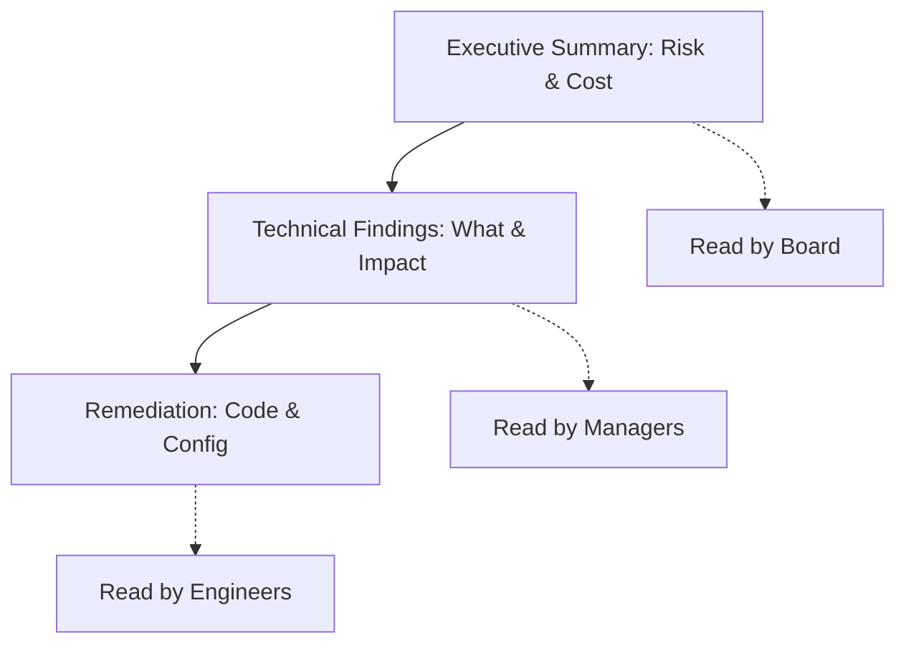


# Executive Reporting: Translating Tech to Risk

> **Executive Summary**: You are not paid to hack; you are paid to write a report. The Executive Summary is the only part of the report that the C-Suite will read. If you cannot translate "Remote Code Execution via Java Deserialization" into "High risk of total data breach and financial loss," you have failed.

## 1. Learning Objectives
By the end of this chapter, you will be able to:
- **Write for Executives**: Focus on Impact, Risk, and Money.
- **Calculate CVSS**: Use the Calculator correctly (Base, Temporal, Environmental).
- **Structure a Report**: Executive Summary, Methodology, Findings, Remediation.
- **Avoid Pitfalls**: No copy-pasting scanner output.

## 2. Core Concepts: The Audience

### 2.1 The CISO/CTO
- Cares about: Compliance, Budget, Resource Allocation.
- Needs: "Which fire do I put out first?"

### 2.2 The CEO/Board
- Cares about: Brand Reputation, Stock Price, Lawsuits.
- Needs: "Are we secure? Yes/No. How much to fix it?"

### 2.3 The Developer/Admin
- Cares about: How to reproduce it. How to fix it (Code snippets).
- Needs: `curl` commands, screenshots, line numbers.

## 3. Deep Dive: The Executive Summary

### 3.1 Structure
1.  **Bottom Line Up Front (BLUF)**: "We successfully compromised the internal network and accessed customer data."
2.  **Narrative**: "Using a phishing email, we gained initial access..." (Story format, no jargon).
3.  **Key Statistics**: 2 Criticals, 5 Highs.
4.  **Strategic Recommendations**: "Implement MFA", "Patch Cycle Improvement".

### 3.2 Translating Tech
- **Bad**: "Exploited MS17-010 via SMB."
- **Good**: "Leveraged a known missing patch to gain administrative control over the billing server."

## 4. Deep Dive: Risk Scoring

### 4.1 CVSS (Common Vulnerability Scoring System)
- **Vector**: `CVSS:3.1/AV:N/AC:L/PR:N/UI:N/S:U/C:H/I:H/A:H` (9.8 Critical).
- **Context Matters**: A SQLi in an internal app with no data (CVSS 8.0) is *less* risky to the business than a weak password on the external ERP (CVSS 7.0). Adjust scores based on **Business Impact**.

## 5. Red Team Perspective

### 5.1 The "So What?" Factor
For every finding, ask "So What?".
- Found XSS? So what? -> "Attacker can steal sessions." -> So what? -> "Attacker can access Patient Records." -> **Impact**.

### 5.2 Chain of Attack
Show how low-risk issues combined to form a high-risk path.
"Information Disclosure + Weak Password + Lack of MFA = Ransomware."

## 6. Practical Lab: Writing the Summary

### Scenario: Domain Compromise
**Facts**:
- Phished user Bob.
- Found password in description field.
- Password reuse on Domain Admin.
- Dumped NTDS.

**Draft Summary**:
"Assessment demonstrated a critical weakness in Identity Management. Consultants were able to compromise the entire network within 4 hours. The primary root causes were insufficient Email Security (Phishing) and poor Password Hygiene. An attacker could have encrypted all business data."

## 7. Diagrams

### The Report Pyramid

## 8. Critical Analysis

### The "Scanner Dump"
The worst sin is exporting a Nessus PDF and calling it a report.
- **False Positives**: You must verify every finding.
- **Context**: A scanner flags "SSL Weak Ciphers" as Medium. If that server is internal and air-gapped, it's Low/Info.

### Interview Questions
1.  **Q**: How do you explain "Buffer Overflow" to a CEO?
    -   **A**: "Imagine pouring a gallon of water into a pint glass. The water spills over and ruins the papers on the desk. In software, this spill crashes the system or allows hackers to rewrite the instructions."
2.  **Q**: What is the difference between Inherent Risk and Residual Risk?
    -   **A**: Inherent = Risk without controls. Residual = Risk remaining *after* controls are applied.

## 9. References
- [[09_Reporting_Professional_Skills/02_Technical_Documentation]]
- [[09_Reporting_Professional_Skills/03_Client_Communication]]
