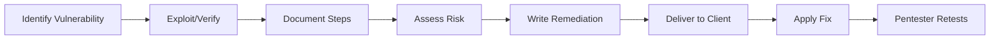


# Technical Documentation: Proof & Remediation

> **Executive Summary**: The technical section of the report is the instruction manual for the IT team. It must be reproducible, precise, and helpful. "Fix XSS" is bad advice. "Implement Context-Aware Encoding using the OWASP ESAPI library" is good advice.

## 1. Learning Objectives
By the end of this chapter, you will be able to:
- **Write Proof of Concepts (PoC)**: Step-by-step instructions to reproduce the bug.
- **Take Screenshots**: Annotate images effectively (Circles/Arrows, no full-screen clutter).
- **Draft Remediation**: Provide short-term fixes and long-term strategic solutions.
- **Classify Findings**: Title, Severity, Difficulty, CVSS.

## 2. Core Concepts: The Finding Block

### 2.1 Standard Fields
- **Title**: "Reflected Cross-Site Scripting in Search Bar".
- **Severity**: High/Medium/Low.
- **Affected Assets**: `https://target.com/search`.
- **CVSS Score**: 6.1.
- **Description**: What is the bug?
- **Impact**: What can happen?
- **Proof of Concept**: Steps.
- **Remediation**: How to fix.

## 3. Deep Dive: The Perfect PoC

### 3.1 Reproducibility
Assume the reader is a Junior Dev.
1.  Navigate to URL `...`.
2.  In the "Search" field, enter `<script>alert(1)</script>`.
3.  Click "Go".
4.  Observe a Javascript alert popup.

### 3.2 HTTP Requests
Include the raw HTTP Request and Response (truncated).
Use code blocks.
```http
GET /search?q=<script>alert(1)</script> HTTP/1.1
Host: target.com
```

### 3.3 Evidence
- **Screenshots**: Highlight the payload in the source code.
- **Video**: For complex race conditions or timing attacks, a GIF/MP4 is worth 1000 words.

## 4. Deep Dive: Effective Remediation

### 4.1 Tiered Advice
- **Tactical (Immediate)**: "Disable the vulnerable service." or "Input validation regex."
- **Strategic (Long Term)**: "Implement a WAF." "Shift to a framework that handles encoding (React)."

### 4.2 Code Samples
Don't just say "Use Parameterized Queries".
Show it:
**Vulnerable**:
`$sql = "SELECT * FROM users WHERE id = " . $id;`
**Fixed**:
`$stmt = $pdo->prepare('SELECT * FROM users WHERE id = :id');`

## 5. Red Team Perspective

### 5.1 Cleaning Up
Documentation includes **Post-Engagement Cleanup**.
- List all files created (`/tmp/shell`).
- List all users added (`backdoor_user`).
- List all configuration changes.
Failure to clean up leaves the client vulnerable.

## 6. Blue Team Perspective

### 6.1 Retesting
The goal of the report is to facilitate a Retest.
If the Blue Team cannot reproduce the bug based on your report, they cannot verify the fix.

## 7. Practical Lab: Documenting an Exploit

### Scenario: IDOR
You found IDOR.

**Title**: Insecure Direct Object Reference in Profile API.
**PoC**:
1. Log in as User A (ID 100).
2. Capture request to `GET /api/profile/100`.
3. Change ID to `101`.
4. Server returns User B's profile.
**Screenshot**: Burp Repeater showing the request and the sensitive response.
**Remediation**: "Enforce authorization checks. Ensure `request.user.id == target.id` before returning data."

## 8. Diagrams

### Finding Lifecycle



## 9. Critical Analysis

### The "Tone"
Avoid arrogance. "You failed to patch..." -> "The system was missing a patch."
Be a partner, not an adversary.
**Severity Inflation**: Don't mark everything Critical to look cool. It creates "Alert Fatigue".

### Interview Questions
1.  **Q**: What is the most important part of a finding?
    -   **A**: The Remediation. Finding bugs is easy; fixing them without breaking business logic is the value add.
2.  **Q**: How do you report a vulnerability found in a 3rd party vendor (e.g., Salesforce)?
    -   **A**: Report it to the client, but advise them to contact the vendor support. Do not exploit SaaS platforms deeper than necessary to prove access (Legal constraints).

## 10. References
- [[09_Reporting_Professional_Skills/01_Executive_Reporting]]
- [[05_Web_Security/02_OWASP_Top_10_Modern]]
