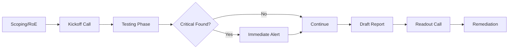


# Client Communication: Scoping & De-escalation

> **Executive Summary**: Soft skills determine career trajectory. A technical wizard who crashes production servers and insults the client will be fired. A professional who communicates risks clearly and manages expectations will be promoted. This chapter covers the engagement lifecycle from Scoping to Debrief.

## 1. Learning Objectives
By the end of this chapter, you will be able to:
- **Scope**: Define Rules of Engagement (RoE), Allow/Block lists, and timing.
- **De-escalate**: Handle a "You crashed our server!" phone call.
- **Present**: Conduct a Readout Call (Debrief).
- **Ethical Handling**: Manage finding PII/Child Exploitation material.

## 2. Core Concepts: The Pre-Game

### 2.1 Scoping (The Contract)
- **Blackbox**: No info. (Simulates real attacker). Time consuming.
- **Whitebox**: Full info (Creds, Source Code). Comprehensive. Best ROI.
- **Greybox**: Partial info (User creds).
- **Scope Creep**: When the client asks "Can you check this IP too?" mid-test. Answer: "We need to amend the contract."

### 2.2 Rules of Engagement (RoE)
- **Forbidden**: DoS, Social Engineering (unless specified), Physical attacks.
- **Critical Hours**: "Don't scan between 9 AM - 5 PM."
- **Emergency Contact**: Who to call if you find a Critical vulnerability or break something.

## 3. Deep Dive: Incident Handling during Test

### 3.1 "The Server is Down"
You scan a legacy box. It crashes. Client calls, angry.
**Response Protocol**:
1.  **Acknowledge**: "I understand the server is down."
2.  **Verify**: "Let me pause all scans immediately."
3.  **Investigate**: Check your logs. Did you scan it? With what speed?
4.  **Communicate**: "We confirmed scanning activity at 10:00. It was a standard Nmap scan. This indicates the server is fragile (DoS vulnerability). Let's restart it and I will blacklist it from further aggressive scans."
5.  **Pivot**: Turn the outage into a Finding ("Lack of Resilience").

### 3.2 "We are being hacked!"
Blue team spots you and thinks it's a real APT.
- **Authentication**: Provide your Source IP and the RoE document signed by the CISO.
- **Deconfliction**: Confirm "Yes, that activity at 2 PM was us."

## 4. Red Team Perspective

### 4.1 Reporting Criticals
If you find:
- Default Admin Creds on the Internet.
- PII / Credit Cards exposed.
- RCE on a core server.
**Do Not Wait for the Report**. Call the Emergency Contact immediately. This is "Value".

### 4.2 Handling PII
If you dump a database and see SSNs:
- **Stop**. Do not download the whole DB.
- Take a screenshot of the *schema* or the first 2 rows (redacted).
- Prove access, don't steal data.

## 5. Blue Team Perspective

### 5.1 The Debrief
- **Audience**: Mixed (Execs + Techs).
- **Tone**: Constructive. Not "You suck," but "Here is how to improve."
- **Walkthrough**: Demo the coolest hack (Visuals win).

## 6. Practical Lab: The Mock Call

### Scenario: The Angry Admin
Admin: "Your scan broke my application! I'm losing money!"
**You**:
- "I'm sorry to hear that. I've stopped all traffic from my IP (10.10.10.10)."
- "Can you confirm the time the instability started?"
- "I was running a web crawl at that time. It seems the app couldn't handle the request volume. This is a finding we should address so real attackers can't DoS you."
- "I will exclude this host for now."

## 7. Diagrams

### The Engagement Lifecycle

## 8. Critical Analysis

### Legal Safety
**Get Out of Jail Free Card**: The signed RoE.
Without it, you are committing a felony (CFAA).
Never scan a target without explicit, written permission from the *owner*. (Scanning AWS requires checking AWS policies, though they are permissive now).

### Interview Questions
1.  **Q**: What do you do if you find Child Exploitation Material (CSAM) on a client server?
    -   **A**: Stop immediately. Do not touch/copy files. Disconnect. Call your Legal Department. They will contact Law Enforcement. Do not inform the Client IT contact (they might be the perp).
2.  **Q**: The client wants a "Pen Test" but only has budget for a "Vulnerability Scan". What do you do?
    -   **A**: Educate them on the difference. A scan is automated (Nessus). A Pen Test involves manual exploitation. Sell them the scan if that's all they can afford, but ensure the SOW says "Vulnerability Assessment", not "Penetration Test", to avoid liability.

## 9. References
- [[09_Reporting_Professional_Skills/01_Executive_Reporting]]
- [[01_Foundations/01_Security_Mindset]]
