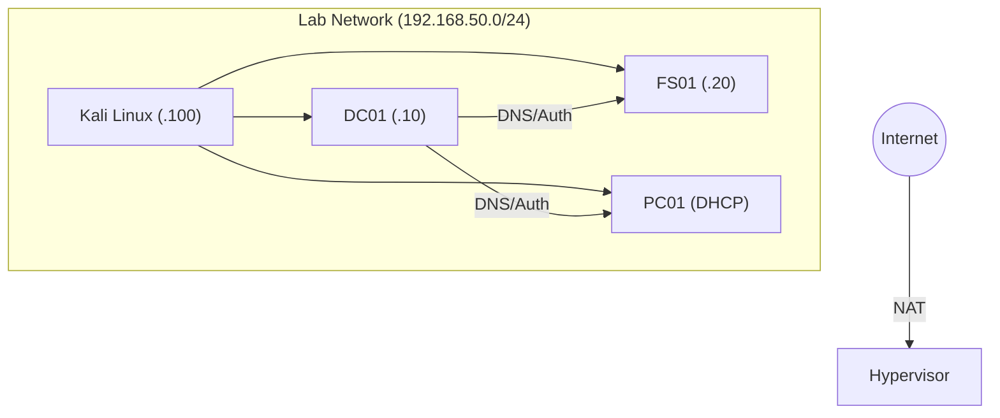


# Building a Home Lab: The Dojo

> **Executive Summary**: You cannot learn hacking by reading. You must do. A Home Lab is your safe space to deploy malware, crash servers, and configure AD. This guide covers setting up a standard AD lab using VirtualBox/VMware.

## 1. Hardware Requirements
- **RAM**: 16GB (Minimum), 32GB+ (Recommended). AD takes RAM.
- **CPU**: 4+ Cores (VT-x/AMD-V enabled in BIOS).
- **Storage**: SSD (NVMe preferred). VMs are slow on HDD.

## 2. Software
- **Hypervisor**: VMware Workstation Pro (Free now!), VirtualBox, or Proxmox (Dedicated server).
- **OS ISOs**:
    - Windows Server 2019/2022 (Evaluation - 180 days free).
    - Windows 10/11 Enterprise (Evaluation).
    - Kali Linux / Parrot OS.
    - Ubuntu Server (for Splunk/ELK).

## 3. Network Architecture

### 3.1 NAT Network
Create a custom network (e.g., `vmnet8` or "NatNetwork").
- **Subnet**: `192.168.50.0/24`.
- **Gateway**: `192.168.50.1` (The Hypervisor).
- **DHCP**: Disabled (We will build our own on the DC).

### 3.2 Inventory
1.  **DC01 (Domain Controller)**:
    - IP: `192.168.50.10`.
    - Roles: AD DS, DNS, DHCP.
2.  **FS01 (Member Server)**:
    - IP: `192.168.50.20`.
    - Roles: File Server, IIS.
3.  **PC01 (Workstation)**:
    - IP: `DHCP`.
    - Joined to Domain.
4.  **KALI (Attacker)**:
    - IP: `192.168.50.100`.
    - Bridges the gap.

## 4. Step-by-Step Build

### 4.1 DC01 Setup
1.  Install Server 2019. Rename PC to `DC01`. Set Static IP.
2.  Install "Active Directory Domain Services".
3.  Promote to Domain Controller.
    - New Forest: `corp.local`.
    - Password: `Password123!` (Safe for lab).
4.  Install DHCP Role. Create Scope `192.168.50.100-200`.

### 4.2 PC01 Join
1.  Install Win10.
2.  Set DNS to `192.168.50.10` (Crucial!).
3.  System -> Rename PC -> Change Domain -> `corp.local`.
4.  Login as `CORP\Administrator`.

### 4.3 Vulnerable Configuration (Goat Mode)
To practice, you need to break things.
- **Disable Defender**: `Set-MpPreference -DisableRealtimeMonitoring $true` (On all VMs).
- **Create Service Accounts**: `sql_svc`, `web_svc`.
- **Set SPNs**: `setspn -S MSSQL/sql01.corp.local sql_svc` (Enables Kerberoasting).
- **SMB**: Disable Signing on FS01.
- **LAPS**: Do not install LAPS yet.

## 5. Automated Labs
Too lazy?
- **GOAD (Game of Active Directory)**: Ansible scripts to deploy a fully broken AD forest on Proxmox/VirtualBox. Highly recommended.
- **BadBlood**: Script to populate AD with thousands of random users and groups.

## 6. Maintenance
- **Snapshots**: Take a snapshot "Clean Install" and "Configured". If you destroy the AD, revert.
- **Evaluations**: Rearm license: `slmgr /rearm`.

## 7. Diagrams

### Lab Topology

