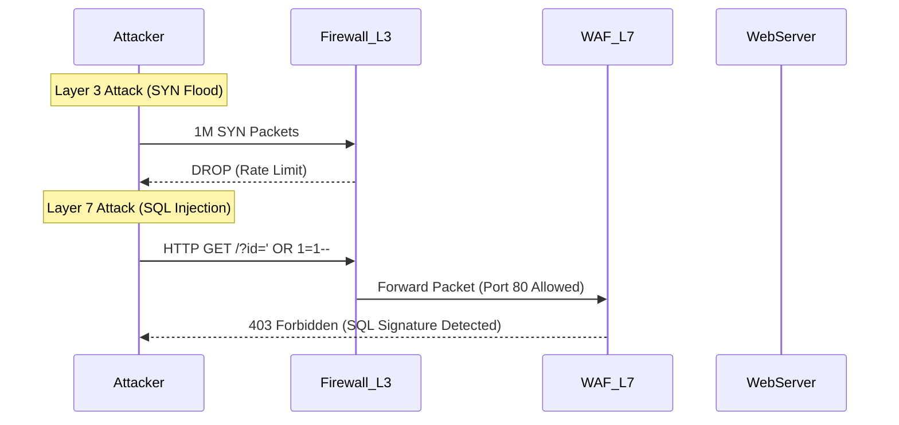


# OSI Model & Attack Vectors

## 1. Learning Objectives
- **Demystify the OSI Model**: Move beyond the mnemonic "Please Do Not Throw Sausage Pizza Away" to understanding it as an attack surface map.
- **Map Protocols to Layers**: Instantly identify where HTTP, DNS, SMB, and ARP live.
- **Correlate Attacks**: Understand why ARP Spoofing is a Layer 2 attack while SQL Injection is Layer 7.
- **Identify Defense Layers**: Know where to place firewalls, IDS, and WAFs.

## 2. Core Concept
The **Open Systems Interconnection (OSI) model** is a conceptual framework used to understand network interactions. For hackers and security engineers, it is not just a theoretical model; it is a **map of the battlefield**.

Every attack targets a specific layer, and every defense monitors a specific layer. If you are attacking a web application (Layer 7), a packet filter firewall (Layer 3/4) is unlikely to stop you. Conversely, if you are conducting an ARP spoofing attack (Layer 2) on a local LAN, a cloud-based WAF (Layer 7) will never see your traffic.

### Real-World Analogy
Imagine sending a physical letter via a corporate mail system:
1.  **Layer 7 (Application)**: You write the letter (the content).
2.  **Layer 6 (Presentation)**: You translate it into a language the recipient understands (encryption/encoding).
3.  **Layer 5 (Session)**: You verify the recipient is available to receive mail.
4.  **Layer 4 (Transport)**: You decide to send it via "Certified Mail" (TCP - guaranteed) or "Standard Post" (UDP - best effort).
5.  **Layer 3 (Network)**: You write the destination address (IP) on the envelope.
6.  **Layer 2 (Data Link)**: The mail truck driver uses a local map (MAC address) to get to the next distribution center.
7.  **Layer 1 (Physical)**: The truck drives on the asphalt road (cables/radio waves).

## 3. Technical Deep Dive: The Layers of Attack

| Layer | Name | Unit | Key Protocols | Attack Vector Examples | Defense Examples |
| :--- | :--- | :--- | :--- | :--- | :--- |
| **7** | **Application** | Data | HTTP, DNS, SMB, SSH, FTP | SQLi, XSS, RCE, Phishing | WAF, App Allowlisting, Input Validation |
| **6** | **Presentation** | Data | TLS/SSL, ASCII, JPEG | Malformed Encoding, SSL Stripping | Encryption enforcement, Encoding checks |
| **5** | **Session** | Data | RPC, NetBIOS, PPTP | Session Hijacking, MITM | Session Timeouts, MFA, Secure Cookies |
| **4** | **Transport** | Segment | TCP, UDP | Port Scanning, SYN Flood | Stateful Firewalls, ACLs |
| **3** | **Network** | Packet | IP, ICMP, IPSec | IP Spoofing, Smurf Attack | Routers, Next-Gen Firewalls (NGFW) |
| **2** | **Data Link** | Frame | Ethernet, ARP, VLAN, Wi-Fi | ARP Spoofing, MAC Flooding, VLAN Hopping | 802.1X, DAI (Dynamic ARP Inspection), Port Security |
| **1** | **Physical** | Bit | Cables, Hubs, Radio | Wiretapping, Jamming, USB Drops | Physical Locks, Faraday Cages |

### Key Nuances
- **Encapsulation**: As data moves down the stack, each layer adds a header. Layer 3 doesn't care about the JSON data in Layer 7; it only cares about the Source and Destination IP.
- **Decapsulation**: As data moves up the stack, headers are stripped.

## 4. Attacker Perspective (Red Team)
**Goal:** Bypass controls by shifting layers.

- **Scenario:** You want to attack a web server.
    - **Layer 3 Block**: The firewall blocks port 80/443 from your IP.
    - **Layer 2 Shift**: You are on the same LAN. You use ARP Spoofing (Layer 2) to impersonate the gateway. Now traffic flows through you.
    - **Layer 7 Shift**: You see the firewall allows traffic to `example.com`. You use Domain Fronting or Host Header injection (Layer 7) to tunnel your C2 traffic.

**Tools:**
- **Layer 2**: `bettercap`, `macchanger`, `yersinia`
- **Layer 3/4**: `nmap`, `hping3`, `masscan`
- **Layer 7**: `Burp Suite`, `OWASP ZAP`, `sqlmap`

## 5. Defender Perspective (Blue Team)
**Detection Strategy:**
- **Layer 2**: Monitor switch logs for "MAC Flapping" (same MAC on different ports).
- **Layer 3**: Flow logs (NetFlow/VPC Flow Logs) show *who* talked to *who* (IPs and Ports).
- **Layer 7**: Web Access Logs (Apache/Nginx/IIS) show *what* they asked for (URL, User-Agent).

> [!INFO]
> **Defense in Depth**: You need visibility at multiple layers. An encrypted C2 channel (Layer 6/7) looks like normal HTTPS traffic at Layer 3/4. You need SSL Inspection (Layer 7 visibility) to catch it.

## 6. Practical Lab: Mapping the Stack
**Scenario:** Analyze a simple `ping` command vs. a `curl` request.

1.  **Step 1**: Open Wireshark or use `tcpdump`.
2.  **Step 2**: Run `ping google.com`.
    ```bash
    ping -c 2 google.com
    ```
    - **Observation**: You will see ICMP (Layer 3). There are no ports (Layer 4) involved in the echo request/reply itself (though ICMP sits on top of IP).
3.  **Step 3**: Run `curl -I google.com`.
    ```bash
    curl -I http://google.com
    ```
    - **Observation**:
        - **L7**: HTTP GET request.
        - **L4**: TCP Syn/Syn-Ack/Ack handshake on port 80.
        - **L3**: Source IP to Dest IP (142.250.x.x).
        - **L2**: Source MAC to Gateway MAC.

## 7. Diagrams



## 8. Checkpoint / Exercises
1.  **Identify the Layer**: Which layer does a Router operate at? Which layer does a Bridge operate at?
2.  **Attack Mapping**: If an attacker uses `responder` to poison LLMNR/NBT-NS, which layers are involved? (Hint: It involves a local broadcast protocol).
3.  **Troubleshooting**: You can ping a server (L3) but cannot load the webpage (L7). Where is the problem likely located?

## 9. References
- [[02_TCP_IP_Deep_Dive]]
- [[04_Common_Protocols_DNS_ARP_DHCP]]
- [[05_Web_Security/01_HTTP_Protocol_Analysis]]
