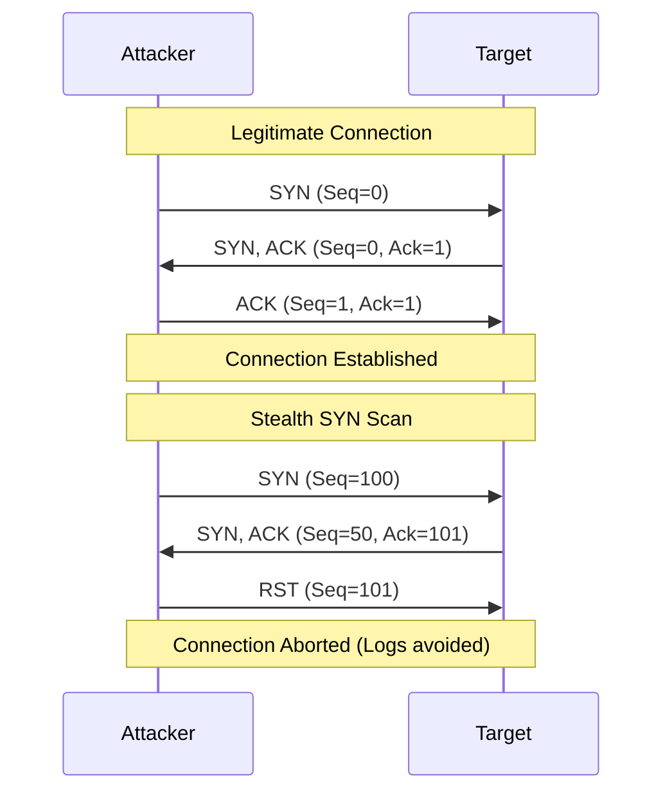


# TCP/IP Deep Dive

## 1. Learning Objectives
- **Master the State Machine**: Understand TCP states (LISTEN, SYN_SENT, ESTABLISHED) to debug connection issues and interpret Nmap output.
- **Decode Flags**: Know exactly what SYN, ACK, FIN, RST, PSH, and URG do in a packet header.
- **Analyze Port Scans**: Explain how a SYN scan differs from a Connect scan at the packet level.
- **Understand Reliability**: How TCP handles packet loss (retransmissions) and why UDP doesn't.

## 2. Core Concept
**Transmission Control Protocol (TCP)** is the backbone of reliable communication. It provides a guaranteed delivery system on top of the unreliable IP layer. For security professionals, TCP is a mechanism to be manipulated. By sending packets that violate the standard state machine, we can elicit unique responses from firewalls and operating systems to map networks.

### Real-World Analogy
**TCP is a Phone Call**:
- **SYN**: "Hello?" (Dialing)
- **SYN-ACK**: "Hello, who is this?" (Picking up)
- **ACK**: "It's Alice." (Connection Established)
- **Data**: (Conversation)
- **FIN**: "Goodbye."
- **ACK**: "Bye." (Click)

**UDP is a Postcard**: You drop it in the box. You don't know if it arrived. You don't get a confirmation.

## 3. Technical Deep Dive

### The 3-Way Handshake (Connection Establishment)
1.  **Client -> Server (SYN)**: "I want to sync. My Sequence Number is X."
2.  **Server -> Client (SYN, ACK)**: "I acknowledge X (ACk=X+1). I want to sync too. My Sequence Number is Y."
3.  **Client -> Server (ACK)**: "I acknowledge Y (ACK=Y+1). Connection Open."

### The Flags
| Flag | Name | Function | Security Relevance |
| :--- | :--- | :--- | :--- |
| **SYN** | Synchronize | Initiates a connection. | Used in SYN Floods and Stealth Scans (`nmap -sS`). |
| **ACK** | Acknowledge | Confirms receipt of data. | Used in ACK Scans (`nmap -sA`) to map firewall rules. |
| **FIN** | Finish | Gracefully closes connection. | Used in FIN Scans (`nmap -sF`) to bypass simple firewalls. |
| **RST** | Reset | Abruptly kills connection. | Sent by closed ports or firewalls blocking connections. |
| **PSH** | Push | Tells receiver to process data immediately. | Often seen in interactive traffic (SSH, Telnet). |
| **URG** | Urgent | Marks data as urgent. | Rarely used; mostly legacy/obscure. |

### Sequence & Acknowledgement Numbers
TCP assigns a number to every byte sent.
- **Sequence Number**: "This packet starts at byte #100."
- **Ack Number**: "I have received up to byte #500. Send me #501 next."
- **Security Implication**: If an attacker can guess the Sequence Number of an active connection, they can inject malicious packets (TCP Hijacking).

## 4. Attacker Perspective (Red Team)
**Goal:** Manipulate the state machine to gather intel or cause denial of service.

### 1. Stealth SYN Scan (`nmap -sS`)
- **Technique**: Send SYN. Receive SYN-ACK. Send RST immediately.
- **Why**: We never complete the handshake, so the application layer (e.g., Apache logs) usually doesn't log a connection.
- **Result**: We know the port is OPEN because we got a SYN-ACK.

### 2. Connect Scan (`nmap -sT`)
- **Technique**: Send SYN. Receive SYN-ACK. Send ACK. (Full connection). Then close.
- **Why**: Used when we don't have root privileges (cannot craft raw packets).
- **Result**: Noisier. Shows up in logs.

### 3. Xmas Tree Scan (`nmap -sX`)
- **Technique**: Send packet with FIN, URG, and PSH flags set (lit up like a Christmas tree).
- **Theory**: RFC 793 says "closed ports reply with RST, open ports ignore it."
- **Reality**: Windows ignores RFC 793 and sends RST for everything, making this scan useless against Windows.

## 5. Defender Perspective (Blue Team)
**Detection Strategy:**
- **SYN Flood**: High volume of SYNs from a single IP without completing the handshake.
- **Port Scanning**: A single IP sending SYNs to many destination ports (Vertical Scan) or many IPs on one port (Horizontal Scan).
- **RST Injection**: A burst of RST packets usually indicates a security device (Firewall/IPS) killing a connection.

> [!TIP]
> **Firewall Rules**:
> - **Stateful**: Tracks the handshake. Allows `ACK` packets only if they match an existing `ESTABLISHED` session.
> - **Stateless**: Simple ACLs. Allows `ACK` packets blindly (vulnerable to ACK scans).

## 6. Practical Lab: Analyzing the Handshake
**Scenario:** Capture a legitimate SSH connection and a port scan.

1.  **Step 1**: Start `tcpdump` on your Kali machine.
    ```bash
    sudo tcpdump -i eth0 -w handshake.pcap port 22
    ```
2.  **Step 2**: Connect to a lab machine via SSH.
3.  **Step 3**: Stop capture and open in Wireshark (`wireshark handshake.pcap`).
4.  **Step 4**: Filter for `tcp.flags.syn == 1`.
    -   Packet 1: SYN (Client -> Server)
    -   Packet 2: SYN, ACK (Server -> Client)
    -   Packet 3: ACK (Client -> Server)
5.  **Step 5**: Compare with a failed connection.
    -   Packet 1: SYN
    -   Packet 2: RST, ACK (Server says "Go away, port closed").

## 7. Diagrams



## 8. Checkpoint / Exercises
1.  **Flag Analysis**: You see a packet with only the `FIN` flag set arriving at a server. The server responds with `RST`. What does this likely mean about the OS or the port state?
2.  **Sequence Math**: If the SYN packet has Seq=1000, what will the ACK number be in the SYN-ACK response?
3.  **Firewall Evasion**: Why might an attacker use an ACK scan (`-sA`) if they know it won't detect open ports? (Hint: It detects *filtering*).

## 9. References
- [[01_OSI_Model_Attack_Vectors]]
- [[08_Tooling_Workflows/01_Nmap_Network_Scanning]]
